<p align="center">
  <a href="README.md">English</a> · <a href="README.ko.md">한국어</a> · <strong>日本語</strong> · <a href="README.zh.md">中文</a>
</p>

<h1 align="center">cladding</h1>

<p align="center">
  <strong>AI にコーディングを任せるには、組織に三つの条件が要る —<br/>コードを信頼でき、その足跡をたどれ、規模が大きくなっても揺るがないこと。cladding はその三つを築く。</strong><br/>
  その名（外装材）のとおりホスト LLM（Claude Code · Codex · Gemini · Antigravity · Cursor）を包み込む — 作業を <em>始める前</em> に、cladding がプロジェクトの意図を渡し、作業を <em>終えた後</em> に、41 個の検出器と 15 段階のゲートで結果を検証する。
</p>

<p align="center">
  <a href="https://github.com/qwerfunch/ironclad"></a>
  <a href="https://github.com/qwerfunch/ironclad"></a>
  
  
  <a href="LICENSE"></a>
</p>

<div align="center">



</div>

> **このループが狙うのはただ一つ —** AI の *「できました」* を、口先の **主張** から **証明** へと変えることだ。

だから、AI が書いたコードを **人が書いたコードと同じ基準で検証して** 送り出せる — 組織がコーディングを AI に委ねるために要る三つ:

- **信頼できる** — すべてのチェックを通過したコードだけが `done` と認められる。検証できない「できました」は決して通らない。
- **たどれる** — **出荷されたものは記録に残る**: 何を検証したかはコミットされた内容に刻まれ、誰がいつやったかはローカルのセッション台帳に、なぜかは spec に残る — だから引き継ぎもレビューも、掘り起こさずに済む。
- **拡張しても揺るがない** — 人と AI が増えれば、普通は衝突と乖離も増える。だが全員が一つの spec を基準に働くので、それらは自動でせき止められる — だから規模を広げても崩れない。

cladding は **自分自身も cladding で作っている** — 270 個の feature のうち 266 個が同じゲートを通過した、[Ironclad](https://github.com/qwerfunch/ironclad) 標準を L4 で実装した最初の事例だ。

<!-- ─────────────── What changes ─────────────── -->

## 何が変わるか

同じ状況で、*素の AI コーディング環境* と cladding 環境の振る舞いがどう違うか。

| 状況 | 素の AI コーディング | cladding |
|---|:---|:---|
| **コードが spec から乖離する** | レビューで *気づけば* 直る | 編集直後に自動検知 · 乖離したままでは「完了」が通らない |
| **AI が「できました」と言う** | 言葉を信じるしかない | ゲートが GREEN のときだけ `done` を獲得 |
| **失敗した状態でセッションを終える** | そのまま終了し、次回には忘れられる | 終了を一度止め、失敗したチェックを修正カードとして引き継ぐ |
| **二人が同時に feature を追加する** | merge conflict | hash-8 ID · ファイル分離 → 衝突 0 |
| **AI が書いたコードは誰が検証する？** | 書いた AI が自分で検証する（危うい） | 実装を見ない採点者 + 機械的なゲート |
| **AI ツールを乗り換える** | ツールごとに再設定 | 1 つの spec → 5 つの host へ自動配線 |

## 誰のためのものか

- **AI にコードを書かせる開発者** — AI が「終わりました」と言っても、cladding はそれを鵜呑みにしない。実際に通ったかを確かめ、通ったときだけ `done` と認める。（ループで自動化するなら[ループのセクション](#cladding-があなたの-ai-ループを支える)がその役だ。）
- **人と AI が一緒に働くチーム** — 人も AI も同じ spec を見て働くので、互いの変更のズレや衝突は自動で捕まる。誰かが知らずに他人の成果を壊すことがない。
- **成果を証明する必要がある組織** — すべての `done` が「実際に検査を通った」という証拠とともにコードに残る。だから数か月後でも「これは検証されたのか？なぜこう作ったのか？」を、記憶ではなくリポジトリで確かめられる。

<!-- ─────────────── How cladding wraps the host LLM ─────────────── -->

## cladding はホスト LLM をどう包み込むか

**前 — 意図を注入する。** LLM が正しいコンテキストで始められるように:

- **効く意図だけを抽出** — いま扱っている feature の *なぜ*、関連する feature、そして受け入れ基準だけを取り出す（spec 全体をそのまま流し込んだりしない）。
- **プロジェクトマップの注入** — feature がいくつあり、何が進行中で、直近の検証結果はどうか。会話が始まるたびに冒頭で LLM へ渡される <sub>（いまはあなたの目でも確認できる ↓）</sub>。
- **プロジェクトのルールを適用** — チームで合意した禁止パターンと推奨パターンを、毎回の常設指示として渡す。

**後 — 検証する:** 15 段階のゲート、41 個の乖離検出器、そして **実装を見ない採点者** — spec に照らして作業を検査するエージェントで、*実装を読む手段を一切持たない* ため、自分が書いたものにお墨付きを与えることはできない。

<sub>リアルタイム介入（マップ注入 · 即時ブロック · 終了ブロック）は Claude Code ですべて動作する。Codex · Gemini · Antigravity · Cursor では同じ検証を、会話中のツール呼び出しと git · CI のゲートで通す。</sub>

<!-- ─────────────── done is earned ─────────────── -->

## 「done」は宣言ではなく、勝ち取るものだ

AI コーディングの持病は、検証の裏づけなしに *「できました」* と宣言されることだ。cladding では、feature の `status: done` は自分で書き込む値ではなく、**勝ち取る** 値だ。

<div align="center">


</div>

① AI が完了マークを **自分で書き込もう** とすると → **その場でブロック** される（「完了は検証で勝ち取ってください」）。

② AI が完了を **要求** すると → 決定的な 9 段階をすべて回し、**全部が通ったときだけ** done として記録する。一つでも落ちれば自動で巻き戻す — E2E · 証拠の段階は CI の全 15 段階が担う。

③ 通過した瞬間に **検証署名** が残る — 「このコードはこの時点で検証された」というコミット可能な証拠だ。

④ 失敗を残したまま会話を終えようとすると → **一度は押しとどめ**（同じ失敗でもう一度終えようとすると、通すのではなく「失敗したまま終了」として記録する）、修正カードを次の会話へ引き継ぐ。

限界も包み隠さず開示する: 即時ブロックが見逃す抜け道は存在し、その場合は事後検証（ゲート · 乖離チェック）が捕まえる。即時ブロックが第一の防衛線、事後検証が第二の防衛線であり、どちらも単独では保証にならない。

<!-- ─────────────── Agent-loop verifier ─────────────── -->

## cladding があなたの AI ループを支える

**ループエンジニアリング**は、AI の使い方を変える：一手ずつプロンプトで指示する代わりに、目標に向けて AI を回し自ら走る**ループ**を作る — 把握、計画、実行、検証、反復。ただしループはその**検証**ステップの分だけしか正直でなく、AI に自分の仕事を自分で検査させれば、毎回自分に合格点を出すだけだ。だからループの中に、本当に**「ノー」**と言える何かを入れる — それが cladding だ。AI の自己評価ではなく、コードをあなたの *spec* と照合してくれる検査だ。

<div align="center">



</div>

ループに与える3つのもの：

- **フィードバック信号** — 反復ごとに、何が・どこで・どれだけ悪く失敗したかを機械可読の素朴な結果として受け取る。コンソール出力を掻き集めずに、そのままループへ戻せる（`clad check --json`）。
- **正直な停止** — ループを終わらせるのは AI の言葉ではなく、ゲートだ。strict なゲートが GREEN のときだけ feature が done になり、そうでなければ巻き戻る。「AI が終わったと言う」が「ゲートがそれを通した」に変わる。
- **ループの記憶** — ローカルのログ（`.cladding/events.log.jsonl`）が前のパスの検査・試行・乖離を覚えているので、次のパスは手探りにならない。

<!-- ─────────────── Project graph ─────────────── -->

## プロジェクトグラフ — いまは目で見て、問いかけられる

これは cladding が内部に描く **あなたのプロジェクトのグラフ** だ — spec · コード · テスト · ドキュメントが、すべてつながっている。それを、いまは目で見て、問いかけられる。

> **なぜ効くのか — 説明とコードが離れていかない。**
> ドキュメントは時間が経つと嘘をつく — コードは変わるのに、説明はそのまま残るからだ。cladding はその結びつきをコードを読むたびに突き合わせ直し、ずれている間は「完了」を止める。

<div align="center">


</div>

<sub>青 = spec（中央）· オレンジ = コード · 緑 = テスト · ピンク = ドキュメント。つながりが多いノードほど大きくなり、中央へ引き寄せられる。</sub>

- **見る** — `clad graph serve` を実行すると、プロジェクト全体がブラウザで開く。何が何につながっているか一目でわかる。
- **尋ねる** — *「ここを直したら何が壊れる？」* グラフに尋ねれば、影響が及ぶコードと回すべきテストを教えてくれる — 当て推量ではない。
- **測る** — プロジェクトが大きいほど効く: 何かを直すときに目を通す量が、中央値で **4×** 少なくて済む（`clad measure` · [測定方法](docs/ab-evaluation/case-efficiency-measurement.md)）。

```bash
clad graph serve                                  # ライブグラフ — localhost:3000、保存すると自動リロード
clad graph export --format html --out graph.html  # または単一のオフラインファイル（.html）に書き出す
```

<sub>どちらも cladding 0.7.0+ が必要。</sub>

<!-- ─────────────── Under the hood ─────────────── -->

## 内部の仕組み

**Spec → Code → Tests** が一つの cycle として回る — spec が *なぜ* を記録し、ゲートが検証し、detector が乖離をせき止める。

<div align="center">



</div>

**Spec — プロジェクトの長期記憶。** LLM はセッションをまたぐと何もかも忘れる。だから spec こそがプロジェクトの意図の住処だ — 永続的で、git でバージョン管理され、モデルが動き出す前に渡される。spec は *why* と *what* を、設計層が *how* を持つ。（出来事のログではなく、意図の記憶だ。）4 階層 — 意図 (A、人が承認するまで封印) / 設計 (B) / コード + attestation (C) / 監査 (D)。**A がすべてに優先する** — spec とコードが食い違えば、間違っているのは *コード* の方だ。

feature はそれぞれ 8 文字のハッシュ ID を持つ専用ファイルに分かれるので、二人が同時に feature を追加しても衝突しない。feature はこう書かれる — テスト可能な受け入れ基準として記された *what* だ:

```yaml
# spec/features/checkout-a1b2c3d4.yaml
id: F-a1b2c3d4
slug: checkout-idempotency
status: done
acceptance_criteria:
  - id: AC-9f3e21a0
    text: "When a charge is retried with the same idempotency key, the system
            shall return the original result and never double-charge."
    test_refs: ["tests/checkout/idempotency.test.ts#retry returns the original charge"]
```

<sub>EARS はすべての基準をテスト可能に保つ — `WHEN <トリガー> … the system SHALL <応答>`、上の `text:` フィールドの形だ。</sub>

→ [4 階層モデル](docs/ssot-model.md) · [ハッシュベースの ID](docs/spec-ids-multi-dev.md)

<div align="center">



</div>

**Gate — 15 段階の Iron Law。** 検査エンジンは一つ、コストで束ねる — commit で 3 段階、push · 完了で 9 段階、CI で 15 段階すべて:

- **静的 (6)** — Type · Lint · Drift · Commit-clean · Architecture · Secrets
- **テスト・適合性 (4)** — Unit · Coverage · Spec-conformance（実装を見ない採点者）· **Deliverable smoke** *（空グリーンを止める: テストは通るのに成果物が一度も動かない）*
- **E2E (3)** — Smoke · Performance · Visual
- **証拠 (2)** — Audit（すべての受け入れ基準に証拠がある）· UAT（すべての done feature に証拠がある）

→ [15 段階の詳細](docs/gate-stages.md)

<div align="center">



</div>

**Detector — 41 個の乖離検出器。** spec · code · test が食い違いうる、あらゆる方向を捕まえる:

| 方向 | 捕まえるもの | 個数 |
|---|---|--:|
| spec ↔ code | spec にはあるのにコードにない、あるいはコードが spec から外れている | 10 |
| code ↔ test | テストのないコード · カバレッジ低下 · 漏れた秘密情報 | 6 |
| spec ↔ test | どのテストも検証しない受け入れ基準 · 虚偽のステータス | 6 |
| spec の健全性 | spec 自体の整合性 — id の衝突 · 依存の循環 | 8 |
| 環境 | ビルド環境 · メタファイル | 3 |
| 検証の鮮度 | 検証署名のあとに変わったコード | 1 |
| ガバナンス · ドキュメント | ポリシー違反 · ドキュメントの乖離 · 根拠を超えた主張 | 4 |
| グラフ · ドキュメントリンク | 壊れた doc ↔ spec のリンク · 欠けた依存エッジ | 3 |

これらの検出器が支えるグラフは、その長期記憶を問い合わせ可能にしたもの — **トレーサビリティ / 検索であって、正確性の主張ではない**: 何が何につながり何を見直すべきか、コードが正しいということではない。→ [detector カタログ全体](src/stages/detectors/README.md)

一つの feature のライフサイクルは **Define → Sync → Implement → Earn** と進む — あらゆるチェックを通してはじめて `done` を勝ち取る。

<!-- ─────────────── Multi-Agent ─────────────── -->

## Multi-Agent

AI にコードを任せれば、たいていテストも一緒に任せることになる。だが同じ AI が両方を書けば、テストは自分が書いたコードに合わせて形づくられる。バグがあってもテストは通る。**緑が何も証明しない状態**だ。

だから cladding は、終わった feature ごとに一つだけ問う: **作った側と確かめた側は、別だったか？** その答えを完了とともに記録に残す。（エージェントを何個どう走らせるかはホストが決める — cladding はマルチエージェント・フレームワークではなく、エージェントを並べることはしない。）

<div align="center">



</div>

- 一つのエージェントが作り、テストし、自分の仕事を自分で通した — `self-certified`。いま自分が書いたコードに合わせてテストを書けるのだから、通ったことは確かめたことにならない。
- 誰も別に確かめていない — 同様に `self-certified`。仕事を責める印ではない。別に確かめた記録がない、という意味だ。
- 別のエージェントが、コードは開けないまま仕様だけを見てテストを書いた — `independent`。バグを見ていないのだから、バグに合わせようがない — 印を決めるのは言葉ではなく、そのエージェントが何を開けたかだ。

作る側と確かめる側を別の手に分けておけばいい。EU AI Act や SOX のような監査規則が求める職務分掌と同じ考えだ — 似ているというだけで、認証ではない。

<!-- ─────────────── Ecosystem ─────────────── -->

## Ecosystem

cladding は既存の三つのカテゴリの結合点に位置する。

<div align="center">



</div>

- **Spec Kit · OpenSpec · Tessl · Kiro** — *良い spec を書く* のを助けるツール。cladding はその上で、*spec と実際のコードが乖離しないかを、開発ループの中で継続的に突き合わせ続ける*。
- **BMAD · ChatDev · Claude Code Agent Teams** — *複数の AI エージェントに役割を分担させる* システム。cladding はその分担を代わりに回すのではなく、ホストが実際に何を動かしたかを *spec · ゲート · 監査記録* に照らして判定する。
- **tdd-guard** — *AI にテストを先に書かせる* ツール。cladding の Unit · Coverage · oracle の各段階が、同じ仕事をより構造的にこなす。
- **OpenHands · Cline · Aider · Goose** — *AI にコードを書かせるランナー*（純粋な実行役）。cladding は、それらのランナーが生み出したコードを *検証し統制する上位レイヤ* だ。

cladding の差別化点は *組み合わせ* にある — 上のカテゴリの核を *一つの検証ループ* に束ねることだ。

<!-- ─────────────── Install ─────────────── -->

## Install

### 1. マシンに一度インストールする

```bash
npm install -g cladding   # cladding CLI をインストール
```

このコマンドはどのディレクトリからでも実行できる。CLI だけをインストールし、AI モデルのコンテキストにはまだ Cladding を追加しない。

### 2. 使用するプロジェクトだけを有効化し、AI ツールを起動する

```bash
cd <project>
clad setup                # このプロジェクトだけに Cladding を接続する

# 一つだけ選び、先頭の「#」を外して実行する:
# codex          # Codex
# claude         # Claude Code
# gemini         # Gemini CLI
# agy            # Antigravity
# cursor-agent   # Cursor Agent
```

`clad setup` はこのマシンで検出された AI ツール（Claude Code・Codex・Gemini・Antigravity・Cursor）を現在のプロジェクト内だけに接続する — ただし Antigravity はプロジェクトローカルの MCP 設定を読まないホストのため、唯一マシン単位で接続される（詳細は [setup ドキュメント](docs/setup.md)）。setup を実行していない別プロジェクトのモデルコンテキストには、Cladding の skill や MCP ツールは入らない。使用する AI ツールのコマンドを一つだけ実行し、Cursor IDE では `<project>` をワークスペースとして開く。setup 後はこのフォルダから新しい AI セッションを開始する。Codex や Gemini がプロジェクトの信頼確認を表示した場合は、それぞれの通常のセキュリティ境界に従って承認する。信頼されるまでプロジェクトローカルの MCP 設定は意図的に読み込まれない。

### 3. Cladding を一度適用する

自分の出発点に合う依頼を AI ツールへ自然な言葉で伝える。

Cladding はまずプロジェクトを読み取り専用で調査する。AI が正確なファイル操作と一度限りの承認フレーズを示し、ユーザーが別の返信でそのフレーズをそのまま入力した場合にだけ初期化を開始する。プロジェクトを開いたり Cladding について質問したりするだけでは、ファイルは変更されない。
この完全一致の手順は偶発的な適用を防ぐが、MCP はツール引数を実際にどのユーザーが作成したかを証明できない。そのため、悪意のある、または侵害されたホストに対するサンドボックスではない。

#### アイデアだけがある場合

```
B2B 決済 SaaS を cladding で始めて。
```

LLM がドメインを分析し、spec・ドキュメント・ポリシーを作成する。重要なプロダクト判断が未解決の場合にだけ最大 3 個の追加質問を行い、完成した計画には質問しない。

#### 企画ドキュメントがある場合

```
docs/plan.md を基に cladding を適用して。
```

ファイルを読み込み、その内容をプロジェクトの intent として使用する。

#### 既存プロジェクトへ導入する場合

```
現在のコードを分析して cladding を適用して。
```

既存コードをスキャンし、観察したパターンとユーザーの intent を組み合わせる。

> **初期化が完了したら、同じ会話でそのまま開発を続ければよい。** 次の機能を自然な言葉で依頼すると、AI は生成された spec とドキュメントを基準に開発し、重要な設計変更もプロジェクトの成長に合わせて反映する。検査はホストが呼び出した時に実行され、自動強制が必要なら任意の Git hook または CI gate を使用する。

```
メールログイン機能をテスト込みで実装して。
```

新しく覚えるコマンドはない。ホスト別の明示的な呼び出し方、より強い Git/CI 適用、検証済みホストの状況は [セットアップ詳細](docs/setup.md) を参照。

<!-- ─────────────── Update ─────────────── -->

## Update

### AI ツールに依頼する（推奨）

プロジェクトで次のように伝える:

```
cladding を最新版に更新して。
```

AI ツールにターミナルとグローバルインストールの権限があれば、CLI の更新、ホスト配線の更新、現在のプロジェクトの更新を実行し、新たな乖離を説明する。権限がなければ、承認または手動実行するコマンドを案内する。

### またはターミナルで直接更新する

```bash
npm update -g cladding   # 1. 新しいバージョンを入れる
cd <project>             # 2. Cladding プロジェクトへ移動
clad update              # 3. プロジェクト接続と派生状態を更新する
```

`clad update` は更新する各 Cladding プロジェクトで実行する。プロジェクト単位の setup も同時に更新するため、別途 `clad setup` を実行する必要はない。ユーザーが作成したコード・機能や spec の本文・ドキュメントは保持され、派生データと Cladding 管理の指示ブロックだけが更新される場合がある。新しいバージョンが乖離を報告したら、その結果を AI ツールに渡せばよい:

```
更新で指摘された乖離を解消して。
```


<!-- ─────────────── Status ─────────────── -->

## Status

| Version | 準拠レベル | Tests | Gate | Features |
|---|---|---|---|---|
| v0.9.2（2026-07） | L4 · [自己申告](https://github.com/qwerfunch/ironclad/blob/main/GOVERNANCE.md) | 2736 / 2736 | 15 段階 · 41 detectors | 270（266 done） |

<sub>248 test files · capability 6 個 · カバレッジ低下は COVERAGE_DROP detector がブロック</sub>

> **Ironclad 1.0 への道** — 1.0 は *独立した二つの実装が L4 準拠フィクスチャを通過してはじめて* 確定する（[GOVERNANCE § 1](https://github.com/qwerfunch/ironclad/blob/main/GOVERNANCE.md)）。cladding はその一つ目だ。

## Docs

- [Why cladding (project context)](docs/project-context.md)
- [A/B & real-usage evidence](docs/ab-evaluation/README.md)
- [4-tier governance model](docs/ssot-model.md)
- [The 15 gate stages](docs/gate-stages.md)
- [Hash-based feature IDs](docs/spec-ids-multi-dev.md)
- [41 detector catalog](src/stages/detectors/README.md)
- [Setup · host wiring · upgrading](docs/setup.md)
- [用語集 (EN · KO)](docs/glossary.md)
- [Governance · roadmap to 1.0](GOVERNANCE.md)

## License

MIT。[LICENSE](LICENSE) · 関連: [Ironclad](https://github.com/qwerfunch/ironclad)（cladding が実装する標準）· [harness-boot](https://github.com/qwerfunch/harness-boot)（seed）。
