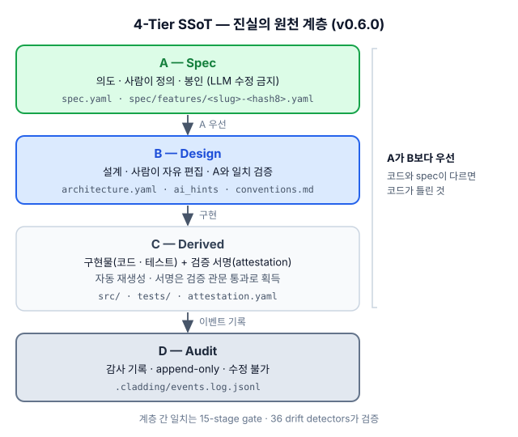
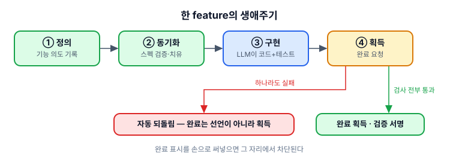

<p align="center">
  
</p>

<p align="center">
  <a href="README.md">English</a> · <strong>한국어</strong>
</p>

<h1 align="center">cladding</h1>

<p align="center">
  <strong>코드는 LLM이 쓴다 — cladding은 그 전과 후를 책임진다.</strong><br/>
  cladding(외장재)이라는 이름 그대로, 호스트 LLM을 감싸는 검증 층.
</p>

<p align="center">
  <a href="https://github.com/qwerfunch/ironclad"></a>
  <a href="https://github.com/qwerfunch/ironclad"></a>
  
  
  <a href="LICENSE"></a>
</p>

<p align="center">
  <a href="https://github.com/qwerfunch/ironclad">Ironclad</a> 표준의 공식 reference 구현.<br/>
  호스트 LLM(Claude Code · Codex · Gemini · Cursor)이 일을 <em>시작하기 전</em>에 프로젝트의 의도를 넣어 주고,<br/>
  일을 <em>마친 후</em>에 36개 검출기와 15단계 게이트로 결과를 검증한다. 같은 목표를 향한 분업이다.
</p>

<!-- ─────────────── 핵심 다이어그램: 호스트 LLM과의 협력 루프 ─────────────── -->

<div align="center">



</div>

<p align="center">
  이 루프가 노리는 것은 하나 —<br/>
  AI의 <em>"다 됐습니다"</em>를 말이 아니라 <strong style="color:#16a34a">증명</strong>으로 만드는 것.
</p>

<p align="center">
  의도는 기록으로 남고 · 어긋남은 자동으로 막히고 · 완료는 검증 서명으로 증명된다.<br/>
  그래서 AI가 짠 코드를 <strong>사람이 짠 코드만큼 믿고</strong> 내보낼 수 있다.
</p>

<p align="center">
  개발자인 당신에게는 — AI 코드 리뷰에 쓰는 시간이 줄고, 6개월 뒤에도 코드의 <em>왜</em>가 남아 있고,<br/>
  배포 전 "정말 다 된 건가"를 더 이상 감으로 판단하지 않아도 된다는 뜻이다.
</p>

## 호스트 LLM과 어떻게 함께 일하나

cladding은 코드를 쓰지 않는다. 코드를 쓰는 건 언제나 **호스트 LLM**이다. cladding이 맡는 건 LLM이 잘하지 못하는 두 가지 — *시작할 때 의도를 정확히 기억시키는 일*과 *끝났을 때 결과를 기계적으로 검증하는 일*이다.

<table>
<tr>
<td width="33%" valign="top">

**전 — 의도를 넣는다**

LLM이 올바른 컨텍스트로 시작하도록.

- **프로젝트 지도 주입** — 대화를 시작할 때마다 "기능 몇 개, 무엇이 진행 중, 마지막 검증 결과"가 자동으로 LLM에게 전달된다
- **꼭 필요한 의도만 추출** — 지금 작업할 기능의 *왜* · 관련 기능 · 검증 기준만 추려서 준다 (스펙 전체를 덤프하지 않는다)
- **프로젝트 규칙 적용** — 팀이 정한 금지 패턴 · 선호 패턴이 매번 표준 지시로 들어간다

</td>
<td width="33%" valign="top">

**후 — 결과를 검증한다**

LLM의 산출물이 스펙과 어긋나면 차단.

- **15단계 검증 관문** — 타입 · 린트 · 테스트 · 커버리지 · 아키텍처 · 시크릿 · E2E · 증거를 한 번에
- **36가지 어긋남 검사** — 스펙↔코드↔테스트가 서로 맞는지 모든 방향에서 자동 대조
- **구현을 못 보는 채점자** — 코드를 읽을 수 없는 별도 에이전트가 스펙만 보고 쓴 테스트로 채점
- **실행물 직접 구동** — "테스트는 통과인데 프로그램은 안 도는" 상황을 실제 실행으로 차단

</td>
<td width="33%" valign="top">

**기록 — 다음 턴의 입력**

검증 결과가 다시 LLM의 컨텍스트로.

- **검증 서명** — 모든 검사를 통과한 코드 상태가 "이 시점에 검증됐다"는 서명으로 저장소에 남는다
- **감사 장부** — 모든 검증 실행 · 완료 시도 · 차단이 누가 · 언제 · 어떤 결과였는지 기록된다
- **수리 카드** — 결정적 검사(어긋남 · 아키텍처 · 시크릿) 실패를 남긴 채 대화를 끝내려 하면 한 번 막아서고, 실패 요약을 다음 대화 시작에 자동으로 실어 보낸다

</td>
</tr>
</table>

<p align="center">이 루프가 도는 동안 사용자는 <strong>평소처럼 자연어로 개발</strong>하면 된다 — 외울 명령이 없다.</p>

<sub>실시간 개입(지도 주입 · 즉시 차단 · 종료 차단)은 Claude Code에서 전부 동작한다. Codex · Gemini · Cursor에서는 같은 검증을 대화 속 도구 호출과 git · CI 관문으로 수행한다.</sub>

## done은 선언이 아니라 획득이다

AI 코딩의 고질병은 *"다 됐습니다"* 가 검증 없이 선언되는 것이다. cladding에서 feature의 `status: done`은 쓰는 값이 아니라 **얻는 값**이다.

<div align="center">



</div>

① AI가 완료 표시를 *직접 써넣으려* 하면 → **그 자리에서 차단**된다 ("완료는 검증으로 얻으세요") — Claude Code 실시간 기준, 다른 host는 게이트 · CI가 같은 역할

② AI가 완료를 *요청*하면 → 결정적 9단계(타입 · 린트 · 어긋남 · 아키텍처 · 시크릿 · 테스트 · 커버리지 · 스펙 적합성 · 실행물 구동)를 전부 돌려 **모두 통과할 때만** 완료로 기록, 하나라도 실패면 자동 되돌림 — E2E · 증거 단계는 CI의 전체 15단계가 맡는다

③ 통과와 동시에 **검증 서명**이 남는다 — "이 코드가 이 시점에 검증됐다"는 커밋 가능한 증거

④ 실패를 남긴 채 대화를 끝내려 하면 → **한 번 막아서고**(같은 실패로 또 끝내면 통과시키는 대신 기록) 수리 카드를 다음 대화로 넘긴다

<sub>한계도 그대로 공개한다: 즉시 차단이 못 보는 우회 경로가 존재하며, 그 경우는 사후 검증(관문 · 어긋남 검사)이 잡는다. 즉시 차단이 1차 방어선, 사후 검증이 2차 방어선이고 어느 쪽도 단독 보증이 아니다.</sub>

## 무엇이 달라지나

같은 상황에서 *일반 AI 코딩 환경*과 cladding 환경의 동작 차이.

<table>
<thead>
<tr><th align="left">상황</th><th align="center">일반 AI 코딩</th><th align="center">cladding</th></tr>
</thead>
<tbody>
<tr><td><strong>코드가 spec과 어긋날 때</strong></td><td align="center" style="color:#64748b">리뷰에서 <em>발견하면</em> 수정</td><td align="center"><strong style="color:#16a34a">편집 직후 자동 감지(알림) · 어긋난 채로는 "완료"가 통과 못 함</strong></td></tr>
<tr><td><strong>AI가 "다 됐다"고 할 때</strong></td><td align="center" style="color:#64748b">말을 믿는 수밖에</td><td align="center"><strong style="color:#16a34a">게이트 GREEN일 때만 done 획득</strong></td></tr>
<tr><td><strong>세션을 실패 상태로 끝낼 때</strong></td><td align="center" style="color:#64748b">그대로 종료, 다음에 잊힘</td><td align="center"><strong style="color:#16a34a">종료를 한 번 막고 수리 카드 인계</strong></td></tr>
<tr><td><strong>두 명이 동시에 feature 추가</strong></td><td align="center" style="color:#64748b">merge conflict</td><td align="center"><strong style="color:#16a34a">hash-8 ID · 파일 분리 → 충돌 0</strong></td></tr>
<tr><td><strong>AI가 짠 코드를 누가 검증?</strong></td><td align="center" style="color:#64748b">작성한 AI가 자기 검증 (위험)</td><td align="center"><strong style="color:#16a34a">구현을 못 보는 채점자 + 기계 관문</strong></td></tr>
<tr><td><strong>AI 도구를 바꿀 때</strong></td><td align="center" style="color:#64748b">도구마다 재구성</td><td align="center"><strong style="color:#16a34a">1 spec → 4 host 자동 연결</strong></td></tr>
</tbody>
</table>

## How it works

**Spec → Code → Tests** 가 한 cycle로 순환한다 — spec이 *왜*를 기록하고, 게이트가 검증하고, detector가 어긋남을 차단한다.

<div align="center">



</div>

### 1. Spec — 의도의 단일 기준 (SSoT)

spec이 *왜*(무엇을 왜 만드는지)를 기록한다. 4-tier 단일 진실 출처 — *의도가 위, 구현물이 아래*.

| Tier | 역할 | 수정 권한 | 권위 |
|---|---|---|---|
| **A — Spec** | 의도 (무엇을 만들까) | 사람이 정의 | 봉인 · LLM 수정 금지 |
| **B — Design** | 설계 (어떻게 만들까) | 사람이 자유 편집 | A와 일치 검증 |
| **C — Derived** | 구현물 (코드 · 테스트) + **attestation** (검증 서명) | LLM · 사람 | 코드 보고 자동 재생성 |
| **D — Audit** | 감사 기록 (무엇이 일어났나) | append-only | 수정 불가 |

**A가 아래 모든 tier보다 우선** — spec(A)과 코드(C)가 다르면 틀린 쪽은 *코드*다. 의도(A)가 흔들리면 모든 게 흔들리므로 LLM이 못 건드리게 봉인한다.

**샤딩 · multi-dev 안전** — `spec/features/<slug>-<hash>.yaml` 처럼 *feature마다 별도 파일* + *8자리 hash ID* (예: `F-d86375d8`). 두 명이 동시에 새 feature를 만들어도 *다른 파일 · 다른 ID* 라 merge conflict 0. 자세히는 [Hash-based feature IDs](docs/spec-ids-multi-dev.md).

<div align="center">



</div>

### 2. Gate — 15단계 Iron Law

"완료"로 인정받으려면 strict 게이트(15단계 중 결정적 9단계)를 전부 통과해야 하고, E2E · 증거까지 포함한 전체 15단계는 CI가 돌린다. 같은 검사 엔진을 시점별 묶음으로 건다 — commit 때 빠른 3단계(git hook 설치 시), push · 완료 시점에 9단계, CI에서 15단계 전부. 깊이가 다를 뿐 검사 로직은 동일하다.

<div align="center">



</div>

| Stage | 무엇을 검사하나 |
|---|---|
| **1.1 Type · 1.2 Lint** | 타입 오류 · 코드 스타일 |
| **1.3 Drift** | 36 detector의 spec ↔ 코드 어긋남 |
| **1.4 Commit · 1.5 Arch · 1.6 Secret** | 작업트리 clean · architecture invariant · API 키 노출 |
| **2.1 Unit · 2.2 Coverage** | 단위 테스트 통과 · coverage 하락 차단 |
| **2.3 Spec conformance · 2.4 Deliverable smoke** | 구현을 못 본 채점자의 테스트 통과 · 선언된 실행물이 실제로 도는지 *("테스트는 통과인데 결과물은 안 도는" 빈 초록 차단)* |
| **3.1 Smoke · 3.2 Perf · 3.3 Visual** | e2e 핵심 동작 · 성능 예산 · UI 시각 회귀 |
| **4.1 Audit · 4.2 UAT** | 모든 AC(수용 기준)에 증거 1건 이상 · 모든 done feature에 증거 1건 이상 |

### 3. Detector — 36개 어긋남 검출기

spec · code · test 사이 모든 방향의 어긋남을 자동 검출한다. 전체 카탈로그: [detector catalog](src/stages/detectors/README.md).

<table>
<thead>
<tr><th>방향</th><th>무엇을 잡나</th><th align="center">수</th><th>대표 detector</th></tr>
</thead>
<tbody>
<tr><td>spec ↔ code</td><td>spec에 있는데 코드에 없거나, 코드가 spec을 벗어남</td><td align="center">10</td><td><code>MISSING_IMPLEMENTATION</code>, <code>AC_DRIFT</code>, <code>DELIVERABLE_INTEGRITY</code></td></tr>
<tr><td>code ↔ test</td><td>코드는 있는데 테스트 없음 · 커버리지 하락 · 시크릿</td><td align="center">6</td><td><code>MISSING_TESTS</code>, <code>COVERAGE_DROP</code>, <code>HARDCODED_SECRET</code></td></tr>
<tr><td>spec ↔ test</td><td>spec의 AC가 테스트로 검증 안 됨 · 상태 거짓</td><td align="center">5</td><td><code>UNTESTED_AC</code>, <code>STATUS_DRIFT</code>, <code>SPEC_CONFORMANCE</code></td></tr>
<tr><td>spec 위생</td><td>spec 자체의 무결성 (ID 충돌 · 순환 의존)</td><td align="center">8</td><td><code>ID_COLLISION</code>, <code>SLUG_CONFLICT</code>, <code>DEPENDENCY_CYCLE</code></td></tr>
<tr><td>환경 무결성</td><td>빌드 환경 · 메타 파일</td><td align="center">3</td><td><code>HARNESS_INTEGRITY</code>, <code>META_INTEGRITY</code></td></tr>
<tr><td>검증 신선도</td><td>검증 서명 이후 코드가 바뀌었는지</td><td align="center">1</td><td><code>STALE_ATTESTATION</code> <em>(0.6.0 신규)</em></td></tr>
<tr><td>거버넌스 · 문서</td><td>정책 위반 · 문서 표류</td><td align="center">3</td><td><code>ABSENCE_OF_GOVERNANCE</code>, <code>PROJECT_CONTEXT_DRIFT</code></td></tr>
</tbody>
</table>

### 4. Cycle — 한 feature의 생애주기

정의 → 동기화 → 구현 → **획득**. 모든 검사를 통과해야 "완료"를 얻는다.

<div align="center">



</div>

## Multi-Agent — 만드는 자와 검증하는 자의 분리

**만드는** 에이전트와 **검증하는** 에이전트가 분리돼 있어 어떤 에이전트도 자기 작업을 스스로 승인하지 못한다. 0.6.0의 **blind-author**는 한 발 더 나간다 — 테스트를 쓰는 에이전트에게 *구현을 읽을 도구 자체가 없다*(Read/Grep 미부여). "구현 안 보고 썼다"가 약속이 아니라 구조적 사실이 된다. 이 분리는 규제 · 감사(EU AI Act · SOX) 기준에 그대로 매핑된다.

<div align="center">



</div>

## Ecosystem

기존 세 카테고리의 결합부에 cladding이 있다.

<div align="center">



</div>

### 인접 도구와의 차이

- **Spec Kit · OpenSpec · Tessl · Kiro** — *spec을 잘 쓰게* 도와주는 도구. cladding은 거기에 더해 *그 spec과 실제 코드가 어긋나지 않는지 개발 루프 안에서 계속 자동 대조*한다 — 완료 시점 · commit · CI까지.
- **BMAD · ChatDev · Claude Code Agent Teams** — *여러 AI 에이전트의 역할 분담* 시스템. cladding의 에이전트 분업은 그 위에 *spec · 게이트 · 감사 기록*까지 결합해 동작한다.
- **tdd-guard** — *AI가 테스트를 먼저 쓰도록 강제*하는 도구. cladding의 15단계 중 Unit · Coverage · oracle 단계가 같은 일을 더 구조적으로 한다.
- **OpenHands · Cline · Aider · Goose** — *AI에게 코드를 짜게 시키는 실행기*. cladding은 그 실행기가 짠 코드를 *검증 · 통제하는 상위 레이어*다.

cladding의 차별점은 *결합* — 위 카테고리의 핵심을 *하나의 검증 루프*로 묶는 것.

## Install

두 단계 — 인프라 설치 → 프로젝트 spec 생성.

### 1단계 — 인프라 설치 (npm)

```bash
npm install -g cladding   # cladding CLI 설치
cd <project>              # 프로젝트로 이동
clad setup                # AI 도구 자동 연결 (Claude / Codex / Gemini / Cursor)
```

`clad setup` 한 번이면 설치된 AI 도구들을 자동 감지해 전부 연결한다 — 도구별 설정을 따로 할 필요가 없다.

<details>
<summary><code>clad setup</code> 이 연결하는 위치 (4개 host · 5개 연결 지점)</summary>

| 호스트 (감지 시) | wire 위치 | 자동 활성화 |
|---|---|---|
| Claude Code (`~/.claude/`) | `~/.claude/plugins/cladding` | `claude plugin marketplace add` + `install` |
| Codex CLI skills (`~/.agents/`) | `~/.agents/skills/cladding-*` | (Codex 재시작 시 자동) |
| Codex CLI MCP 서버 (`~/.codex/`) | `~/.codex/config.toml` 의 `[mcp_servers.cladding]` | (TOML entry 자체) |
| Gemini CLI (`~/.gemini/`) | `~/.gemini/extensions/cladding` | `gemini extensions link` |
| Cursor (`~/.cursor/`) | `~/.cursor/mcp.json` 의 `mcpServers.cladding` | (JSON entry 자체) |

`clad setup` 은 `claude` / `gemini` binary 가 PATH 에 있을 때 각 host 의 활성화 명령을 자동 호출. 업그레이드 후나 새 AI 도구 설치 후 다시 실행해도 안전하다.

**검증 수준(정직 고지):** Claude Code는 실사용 캠페인으로 전 기능 검증됨(실시간 개입 포함). Codex · Gemini CLI는 배선 자동화 + 기본 동작 확인. Cursor는 연결은 자동이지만 실사용 검증이 아직이다 — 검증되는 대로 갱신.

> **MCP 서버에 대하여.** 4 host 모두 cladding을 MCP 서버로 wire한다 — wire *위치*만 다르다. MCP는 사용자가 직접 호출하는 것이 아니다 — `/mcp` 슬래시도, 수동 연결 단계도 없다. 각 host의 AI가 *자연어 요청*에 응답해 cladding의 기능을 알아서 호출하며, 사용자는 `/cladding:init` 한 번과 일반 대화만 입력한다.

</details>

### 2단계 — Init (프로젝트 spec 생성)

프로젝트 디렉토리에서, AI 도구 안에서 한 번 호출:

```
[AI 도구 안] /cladding:init "B2B 결제 SaaS"
```

프로젝트의 `spec.yaml` 과 관련 문서가 만들어진다 — 프로젝트당 한 번.

강제력을 높이려면: `clad init --with-hook`(pre-commit + pre-push git hook 설치) · `clad init --with-ci`(CI 게이트 스캐폴드 — 진짜 강제는 CI에서).

### 세 가지 init 시나리오

| 시작 상황 | 명령 | 무엇이 일어나는가 |
|---|---|---|
| **아이디어만 있을 때** | `/cladding:init "B2B 결제 SaaS 만들거야"` | LLM이 도메인 분석 → spec · 문서 · 정책 자동 생성 + 후속 질문 2–3개 |
| **기획 문서가 있을 때** | `/cladding:init docs/plan.md` | 파일 경로 인식 → 내용을 자동 로드해 intent로 사용 |
| **기존 프로젝트 도입** | `/cladding:init "이 프로젝트에 cladding 적용해줘"` | 기존 코드 자동 스캔 → 관찰한 패턴 + intent 결합 |

### init 한 번이면 끝

한 번 init하면 그걸로 끝 — 그 뒤론 평소처럼 개발하면 된다. cladding이 배경에서 전 · 후 루프를 돌리니, 따로 외울 명령은 없다.

### 업그레이드

```
npm update -g cladding     # 1. 새 버전 설치
cd <your project>          # 2. 프로젝트마다 한 번씩
clad update                # 3. 새 버전에 맞게 정리
```

당신이 쓴 코드 · `spec.yaml` · 문서는 그대로 두니 안전하고, 새 버전이 더 깐깐해 짚을 게 있으면 **알려만** 준다 (막거나 고치지 않음).

## Status

<table align="center" style="border:none">
<tr style="border:none">
<td style="text-align:center;width:140px;background:#f8fafc;padding:18px 10px;border-radius:8px;border:none">
<div style="font-size:11px;color:#64748b;letter-spacing:1.5px;text-transform:uppercase;font-weight:600">version</div>
<div style="font-size:24px;font-weight:800;color:#0f172a;margin:8px 0;letter-spacing:-0.5px">v0.6.0</div>
<div style="font-size:11px;color:#64748b">2026-06</div>
</td>
<td style="text-align:center;width:140px;background:#dcfce7;padding:18px 10px;border-radius:8px;border:none">
<div style="font-size:11px;color:#15803d;letter-spacing:1.5px;text-transform:uppercase;font-weight:600">준수 등급</div>
<div style="font-size:24px;font-weight:800;color:#16a34a;margin:8px 0;letter-spacing:-0.5px">L4</div>
<div style="font-size:11px;color:#15803d"><a href="https://github.com/qwerfunch/ironclad/blob/main/GOVERNANCE.md" style="color:#15803d">L0–L4 중 최고 · 자가 선언</a></div>
</td>
<td style="text-align:center;width:140px;background:#f8fafc;padding:18px 10px;border-radius:8px;border:none">
<div style="font-size:11px;color:#64748b;letter-spacing:1.5px;text-transform:uppercase;font-weight:600">tests</div>
<div style="font-size:24px;font-weight:800;color:#0f172a;margin:8px 0;letter-spacing:-0.5px">1384<span style="font-size:16px;color:#94a3b8">/1384</span></div>
<div style="font-size:11px;color:#64748b">all pass</div>
</td>
<td style="text-align:center;width:140px;background:#f8fafc;padding:18px 10px;border-radius:8px;border:none">
<div style="font-size:11px;color:#64748b;letter-spacing:1.5px;text-transform:uppercase;font-weight:600">gate</div>
<div style="font-size:24px;font-weight:800;color:#0f172a;margin:8px 0;letter-spacing:-0.5px">15<span style="font-size:16px;color:#94a3b8"> 단계</span></div>
<div style="font-size:11px;color:#64748b">36 detectors</div>
</td>
<td style="text-align:center;width:140px;background:#f8fafc;padding:18px 10px;border-radius:8px;border:none">
<div style="font-size:11px;color:#64748b;letter-spacing:1.5px;text-transform:uppercase;font-weight:600">features</div>
<div style="font-size:24px;font-weight:800;color:#0f172a;margin:8px 0;letter-spacing:-0.5px">171</div>
<div style="font-size:11px;color:#64748b">170 done · 자기 스펙</div>
</td>
</tr>
</table>

<sub>134 test files · coverage는 COVERAGE_DROP detector가 하락 차단 · 설치는 npm 단일 경로(<code>npm install -g cladding</code>)</sub>

> **Ironclad 1.0까지의 길** — 1.0은 *독립적인 두 개의 구현이 L4 검증 셋을 통과해야* 잠긴다 ([GOVERNANCE § 1](https://github.com/qwerfunch/ironclad/blob/main/GOVERNANCE.md)). cladding이 첫 번째.

## Docs

- [Why cladding (project context)](docs/project-context.md)
- [4-tier governance model](docs/ssot-model.md)
- [Hash-based feature ID](docs/spec-ids-multi-dev.md)
- [36 detector catalog](src/stages/detectors/README.md)
- [용어집 (EN · KO)](docs/glossary.md)
- [Governance · roadmap to 1.0](GOVERNANCE.md)

## License

MIT. [LICENSE](LICENSE) · 관련: [Ironclad](https://github.com/qwerfunch/ironclad) (구현 대상 표준) · [harness-boot](https://github.com/qwerfunch/harness-boot) (seed).
