<p align="center">
  <a href="README.md">English</a> · <strong>한국어</strong> · <a href="README.ja.md">日本語</a> · <a href="README.zh.md">中文</a>
</p>

<h1 align="center">cladding</h1>

<p align="center">
  <strong>기업이 AI에게 코딩을 맡기려면 세 가지가 필요하다 —<br/>믿을 수 있고, 추적되고, 규모가 커져도 흔들리지 않아야 한다. cladding이 그 셋을 만든다.</strong><br/>
  cladding(외장재)이라는 이름 그대로, 호스트 LLM(Claude Code · Codex · Gemini · Antigravity · Cursor)을 감싼다: 일을 <em>시작하기 전</em>엔 프로젝트의 의도를 넣어 주고, <em>마친 후</em>엔 41개 검출기와 15단계 게이트로 결과를 검증한다.
</p>

<p align="center">
  <a href="https://github.com/qwerfunch/ironclad"></a>
  <a href="https://github.com/qwerfunch/ironclad"></a>
  
  
  <a href="LICENSE"></a>
</p>

<div align="center">


</div>

> **이 루프가 노리는 것은 하나 —** AI의 *"다 됐습니다"*를 말이 아니라 **증명**으로 만드는 것이다.

그래서 AI가 짠 코드를 **사람이 짠 코드와 같은 기준으로 검증해** 내보낼 수 있다 — 기업이 AI에게 코딩을 맡기는 데 필요한 세 가지다.

- **신뢰** — 모든 검사를 통과한 코드만 `done`으로 인정된다. 검증할 수 없는 "다 됐습니다"는 결코 통과하지 못한다.
- **추적** — **나간 것은 기록에 남는다**: 무엇을 검증했는지는 커밋된 내용에 새겨지고, 누가·언제는 로컬 세션 로그에, 왜는 스펙에 남아, 인수인계와 리뷰가 파헤치지 않아도 된다.
- **확장** — 사람과 AI를 늘리면 보통 충돌과 어긋남도 함께 불어난다. 하지만 모두가 스펙 하나를 기준으로 일하니 그게 자동으로 걸린다 — 그래서 규모를 키워도 무너지지 않는다.

cladding은 **자기 자신도 cladding으로 만든다** — 기능 276개 중 272개가 같은 게이트를 통과했고, [Ironclad](https://github.com/qwerfunch/ironclad) 표준을 L4로 구현한 첫 사례다.

## 이 fork — 토큰 최적화 레이어

> cladding **0.9.2** 에 토큰 비용 레이어를 더한 fork입니다. 기존 동작은 그대로 보존되며,
> 추가 기능은 모두 **가산적이고 기본 off** 입니다.

**0.9.2 대비 무엇이 바뀌었나**

| 추가 | 하는 일 | 기본값 |
|---|---|---|
| 영어 canonical spec (i18n) | 모델이 읽는 canonical을 영어로 저작(한국어 대비 ~50% 토큰↓) + 사람용 현지어 companion view | on (`CLADDING_SPEC_LANG=en`) |
| cheap-model intent relay | 큰 비영어 intent를 onboarding 전에 영어로 1회 정규화 (SDK 모드) | off (`CLADDING_I18N`) |
| 네이티브 Headroom 압축기 | 순수 TS, in-process — **Python/Rust/프록시/설치 불필요**: `json_dedup`+`log_dedup`(lossy), `json_minify`+`ws_collapse`(lossless). 대량 JSON/로그 도구출력 ~98% | off (`CLADDING_HEADROOM`) |
| `auto` 압축→복구 | 압축하되, 모델이 생략분이 필요하다고 신호하면 그 턴만 원본으로 재-dispatch | `CLADDING_HEADROOM` 모드 |
| drive-loop 게이트실패 주입 | 재시도 시 실패한 Type/Lint/Arch 출력을 다음 dispatch에 (압축해) 실어 에이전트가 무엇을 고칠지 알게 함 | 게이트 실패 시 항상 |

실측: canonical 재독 ~50% 상시, 대량 도구/게이트 출력 ~98%, **세션당 통합 ~78%** 절감.
능력·제품 품질은 stock과 **동률** — 이 추가들은 "더 똑똑하게"가 아니라 **코스트 + 신뢰성**을
삽니다. [`docs/deep-ab-report.md`](docs/deep-ab-report.md),
[`docs/headroom-integration.md`](docs/headroom-integration.md) 참고.

**이 fork 설치** (외부 엔진 불필요 — 압축기가 패키지에 내장)

```bash
npm install -g 'git+https://github.com/yuyu04/cladding.git#feat/headroom-native'
# 또는: git clone -b feat/headroom-native https://github.com/yuyu04/cladding.git \
#         && cd cladding && npm i && npm run build && npm link
```

**켜고 끄기** — 환경변수 (설정 파일은 아직 없음)

```bash
export CLADDING_HEADROOM=on              # off(기본) | on | simulate | auto
export CLADDING_HEADROOM_MIN_TOKENS=1500 # (선택) 이보다 작은 payload는 건너뜀
export CLADDING_SPEC_LANG=en             # canonical 저작 언어 (기본 en)
export CLADDING_I18N=on                   # 큰 비영어 intent를 영어로 정규화 (SDK 모드)
```

매번 한정 적용: `CLADDING_HEADROOM=on clad run`.

> **함정 2가지.** (1) env가 **실제 `clad` 프로세스**에 도달해야 함 — MCP 서버/호스트 플러그인으로
> 띄우면 *그 프로세스* env에 넣어야지 터미널 export만으론 안 닿음. (2) Headroom 압축과 i18n relay는
> **SDK 모드**(`ANTHROPIC_API_KEY` 설정)에서만 작동 — host 모드에선 no-op(영어 canonical 저작은 그대로).

<!-- ─────────────── 무엇이 달라지나 ─────────────── -->

## 무엇이 달라지나

같은 상황에서 *일반 AI 코딩 환경*과 cladding 환경의 동작 차이.

| 상황 | 일반 AI 코딩 | cladding |
|---|:---|:---|
| **코드가 spec과 어긋날 때** | 리뷰에서 *발견하면* 수정 | 편집 직후 자동 감지 · 어긋난 채로는 "완료"가 통과 못 함 |
| **AI가 "다 됐다"고 할 때** | 말을 믿는 수밖에 | 게이트 GREEN일 때만 done 획득 |
| **세션을 실패 상태로 끝낼 때** | 그대로 종료, 다음에 잊힘 | 종료를 한 번 막고, 실패한 검사를 수리 카드로 인계 |
| **두 명이 동시에 feature 추가** | merge conflict | hash-8 ID · 파일 분리 → 충돌 0 |
| **AI가 짠 코드를 누가 검증?** | 작성한 AI가 자기 검증 (위험) | 구현을 못 보는 채점자 + 기계 관문 |
| **AI 도구를 바꿀 때** | 도구마다 재구성 | 1 spec → 5 host 자동 연결 |

## 누구를 위한 것

- **AI에게 코드를 맡기는 개발자** — AI가 "다 됐어요"라고 해도 그대로 믿지 않는다. cladding이 실제로 통과했는지 확인하고, 통과했을 때만 `done`으로 인정한다. (루프로 자동화한다면 [루프 섹션](#cladding이-당신의-ai-루프를-받쳐-준다)이 그 역할을 한다.)
- **사람과 AI가 함께 일하는 팀** — 사람이든 AI든 같은 스펙을 보고 일하니, 서로의 작업이 어긋나거나 충돌하면 자동으로 잡힌다. 누가 남의 것을 모르고 깨뜨리는 일이 없다.
- **결과를 증명해야 하는 조직** — 모든 `done`이 "실제로 검사를 통과했다"는 증거와 함께 코드에 남는다. 그래서 몇 달 뒤에도 "이거 검증된 건가? 왜 이렇게 했지?"를 기억이 아니라 저장소에서 바로 확인할 수 있다.

<!-- ─────────────── cladding이 호스트 LLM을 감싸는 방식 ─────────────── -->

## cladding이 호스트 LLM을 감싸는 방식

**전 — 의도를 넣는다.** LLM이 올바른 컨텍스트로 시작하도록:

- **필요한 의도만** — 작업할 기능의 *왜*·관련 기능·검증 기준만 (전체 스펙을 덤프하지 않는다).
- **프로젝트 지도 주입** — 기능 수·진행 상황·마지막 검증 결과를 대화를 시작할 때마다 넘겨준다 <sub>(이제 눈으로도 볼 수 있다 ↓)</sub>.
- **팀 규칙 적용** — 팀이 합의한 금지·선호 패턴을 매번 표준 지시로.

**후 — 결과를 검증한다:** 15단계 게이트 · 41개 어긋남 검출기 · 그리고 **구현을 못 보는 채점자** — 구현을 읽을 도구 없이 산출물을 스펙과 대조하는 에이전트라, 자기가 쓴 것에 도장을 찍어 줄 수 없다.

<sub>실시간 개입(지도 주입 · 즉시 차단 · 종료 차단)은 Claude Code에서 전부 동작한다. Codex · Gemini · Antigravity · Cursor에서는 같은 검증을 대화 속 도구 호출과 git · CI 관문으로 수행한다.</sub>

<!-- ─────────────── done은 획득이다 ─────────────── -->

## done은 선언이 아니라 획득이다

AI 코딩의 고질병은 *"다 됐습니다"* 가 검증 없이 선언되는 것이다. cladding에서 feature의 `status: done`은 쓰는 값이 아니라 **얻는 값**이다.

<div align="center">


</div>

① AI가 완료 표시를 *직접 써넣으려* 하면 → **그 자리에서 차단**된다 ("완료는 검증으로 얻으세요")

② AI가 완료를 *요청*하면 → 결정적 9단계를 전부 돌려 **모두 통과할 때만** 완료로 기록, 하나라도 실패면 자동 되돌림 — E2E · 증거 단계는 CI의 전체 15단계가 맡는다

③ 통과와 동시에 **검증 서명**이 남는다 — "이 코드가 이 시점에 검증됐다"는 커밋 가능한 증거

④ 실패를 남긴 채 대화를 끝내려 하면 → **한 번 막아서고**(같은 실패로 또 끝내면 통과시키지 않고 '실패한 채 종료'로 기록) 수리 카드를 다음 대화로 넘긴다

<sub>한계도 그대로 공개한다: 즉시 차단이 못 보는 우회 경로가 존재하며, 그 경우는 사후 검증(관문 · 어긋남 검사)이 잡는다. 즉시 차단이 1차 방어선, 사후 검증이 2차 방어선이고 어느 쪽도 단독 보증이 아니다.</sub>

<!-- ─────────────── 에이전트 루프의 검증자 ─────────────── -->

## cladding이 당신의 AI 루프를 받쳐 준다

**루프 엔지니어링**은 AI를 쓰는 방식을 바꾼다: 한 단계씩 프롬프트로 시키는 대신, 목표를 향해 AI를 굴리며 스스로 도는 **루프**를 만드는 것이다 — 파악, 계획, 실행, 검증, 반복. 하지만 루프는 그 **검증** 단계만큼만 정직하고, AI가 자기 일을 스스로 검사하게 두면 매번 자기한테 합격점만 준다. 그래서 루프 안에 진짜로 **"아니오"**라고 말할 수 있는 무언가를 넣는다 — 그게 cladding이다. AI의 자기 판단이 아니라, 코드를 *당신의 스펙*에 대조해 주는 검사다.

<div align="center">



</div>

루프에 주는 세 가지:

- **피드백 신호** — 매 패스마다 무엇이, 어디서, 얼마나 나쁘게 실패했는지 기계가 읽는 결과로 돌려받는다. 콘솔 텍스트를 긁을 필요 없이 그대로 루프에 되먹인다 (`clad check --json`).
- **정직한 멈춤** — 루프는 AI의 말이 아니라 게이트로 끝난다. 엄격 게이트가 GREEN일 때만 피처가 done이 되고, 아니면 되돌린다. "AI가 끝났다고 한다"가 "게이트가 통과시켰다"로 바뀐다.
- **루프 기억** — 로컬 로그(`.cladding/events.log.jsonl`)가 이전 패스의 검사·시도·드리프트를 기억해서, 다음 패스가 맨눈으로 시작하지 않는다.

<!-- ─────────────── 프로젝트 그래프 ─────────────── -->

## 프로젝트 그래프 — 이제 눈으로 보고 물어본다

이것은 cladding이 **프로젝트를 안에서 그려 둔 그래프**다 — 스펙 · 코드 · 테스트 · 문서가 전부 연결돼 있다. 이제 눈으로 보고, 물어볼 수 있다.

> **왜 특별한가 — 설명과 코드가 따로 놀지 않는다.** 문서는 시간이 지나면 거짓말을 한다 — 코드는 바뀌는데 설명은 그대로니까. cladding은 그 연결을 코드를 볼 때마다 다시 맞추고, 어긋난 채로는 '완료'를 막는다.

<div align="center">


</div>

<sub>파랑 = 스펙(가운데) · 주황 = 코드 · 초록 = 테스트 · 분홍 = 문서; 연결이 많은 노드일수록 커지고 가운데로 당겨진다.</sub>

- **본다** — `clad graph serve` 하면 프로젝트 전체가 브라우저에 떠서, 뭐가 뭐랑 연결됐는지 한눈에 보인다.
- **물어본다** — *"이거 고치면 뭐가 깨지지?"* 그래프에 물어보면 영향받는 코드와 돌려야 할 테스트가 나온다 — 추측하지 않는다.
- **재본다** — 프로젝트가 클수록 더 아낀다: 뭔가 고칠 때 읽어야 할 양이 중앙값 기준 **4배 적다** (`clad measure` · [측정 방법](docs/ab-evaluation/case-efficiency-measurement.md)).

```bash
clad graph serve                                  # 라이브 그래프 — localhost:3000, 저장하면 자동 새로고침
clad graph export --format html --out graph.html  # 또는 오프라인 한 파일(.html)로 내보내기
```

<sub>cladding 0.7.0 이상이 필요하다.</sub>

<!-- ─────────────── 내부 동작 ─────────────── -->

## 내부 동작

**Spec → Code → Tests** 가 한 cycle로 순환한다 — spec이 *왜*를 기록하고, 게이트가 검증하고, detector가 어긋남을 차단한다.

<div align="center">


</div>

**Spec — 프로젝트의 장기 기억.** LLM은 세션이 바뀌면 아무것도 기억하지 못한다. 그래서 스펙은 프로젝트의 *의도*가 사는 곳이다 — 지속적이고, git에 버전 관리되며, 모델이 시작하기 전에 먼저 주입된다. 스펙은 *why*와 *what*을 담고, 바로 아래 설계 계층이 *how*를 담는다. (일어난 일의 로그가 아니라 의도의 기억이다.) 위에서 아래로 4계층 — 의도(A)는 사람이 승인하기 전엔 봉인되고, 그다음 설계(B), 코드 + attestation(C), 감사(D). **A가 모든 계층보다 우선** — 스펙과 코드가 어긋나면 틀린 쪽은 *코드*다.

기능마다 8자리 hash ID를 가진 별도 샤드 파일이라, 두 명이 동시에 기능을 추가해도 절대 충돌하지 않는다. 기능 하나는 이렇게 생겼다 — *무엇*을, 검증 가능한 수용 기준으로 쓴 것:

```yaml
# spec/features/checkout-a1b2c3d4.yaml
id: F-a1b2c3d4
slug: checkout-idempotency
status: done
acceptance_criteria:
  - id: AC-9f3e21a0
    text: "When a charge is retried with the same idempotency key, the system
            shall return the original result and never double-charge."
    test_refs: ["tests/checkout/idempotency.test.ts#retry returns the original charge"]
```

<sub>EARS는 모든 기준을 검증 가능하게 유지한다 — `WHEN <트리거> … the system SHALL <응답>`, 위 `text:` 필드의 형태다.</sub>

→ [4계층 모델](docs/ssot-model.md) · [hash 기반 ID](docs/spec-ids-multi-dev.md)

<div align="center">


</div>

**Gate — 15단계 Iron Law.** 검사 엔진은 하나, 비용에 따라 묶어서 건다 — commit 때 3단계, push · 완료 시점에 9단계, CI에서 15단계 전부:

- **정적 (6)** — Type · Lint · Drift · Commit-clean · Architecture · Secrets
- **테스트 · 적합성 (4)** — Unit · Coverage · Spec-conformance(구현을 못 보는 채점자) · **Deliverable smoke** *(빈 초록을 차단한다: 테스트는 통과하는데 산출물은 한 번도 실행되지 않는 경우)*
- **E2E (3)** — Smoke · Performance · Visual
- **증거 (2)** — Audit(모든 수용 기준에 증거가 있다) · UAT(모든 done 기능에 증거가 있다)

→ [15단계 전체](docs/gate-stages.md)

<div align="center">


</div>

**Detector — 41개 어긋남 검출기.** spec · code · test가 어긋날 수 있는 모든 방향을 잡는다:

| 방향 | 잡는 것 | # |
|---|---|--:|
| spec ↔ code | 스펙에는 있는데 코드에 없거나, 스펙에서 벗어난 코드 | 10 |
| code ↔ test | 테스트 없는 코드 · coverage 하락 · 새어 나간 비밀 | 6 |
| spec ↔ test | 어떤 테스트도 검증하지 않는 수용 기준 · 거짓 상태 | 6 |
| spec 위생 | 스펙 자체의 무결성 — id 충돌 · 의존성 순환 | 8 |
| 환경 | 빌드 환경 · meta 파일 | 3 |
| 검증 신선도 | 검증 서명 이후 바뀐 코드 | 1 |
| 거버넌스 · 문서 | 정책 위반 · 문서 어긋남 · 근거를 넘어선 주장 | 4 |
| 그래프 · 문서 링크 | 끊어진 문서 ↔ 스펙 링크 · 빠진 의존성 엣지 | 3 |

이 검출기들이 떠받치는 그래프는 그 장기기억을 질의 가능하게 만든 것 — **traceability / retrieval이지 정확성 주장이 아니다**: 무엇이 무엇에 연결되고 무엇을 다시 봐야 하는지, 코드가 옳다는 게 아니다. → [detector 카탈로그 전체](src/stages/detectors/README.md)

한 기능의 생애주기는 **Define → Sync → Implement → Earn**으로 흐른다 — 모든 검사를 통과해야만 `done`을 얻는다.

<!-- ─────────────── Multi-Agent ─────────────── -->

## Multi-Agent

AI에게 코드를 맡기면 보통 테스트도 같이 맡긴다. 그런데 같은 AI가 둘 다 쓰면, 테스트는 자기가 쓴 코드에 맞춰진다. 버그가 있어도 테스트는 통과한다. **초록불이 아무것도 증명하지 못하는 상태**다.

그래서 cladding은 기능이 끝날 때마다 한 가지를 묻는다: **만든 쪽과 확인한 쪽이 서로 달랐는가?** 그 답을 완료에 적어 둔다. (에이전트를 몇 개로 어떻게 돌릴지는 호스트가 정한다 — cladding은 멀티에이전트 프레임워크가 아니고, 에이전트를 배치하지 않는다.)

<div align="center">



</div>

- 한 에이전트가 만들고, 테스트하고, 스스로 통과시켰다 — `self-certified`. 자기가 방금 쓴 코드에 테스트를 맞출 수 있으니, 통과가 곧 확인은 아니다.
- 아무도 따로 확인하지 않았다 — 마찬가지로 `self-certified`. 잘못했다는 뜻이 아니다. 확인한 기록이 없다는 뜻이다.
- 다른 에이전트가 코드는 못 본 채 스펙만 보고 테스트를 썼다 — `independent`. 버그를 못 봤으니 버그에 맞출 수도 없다 — 라벨을 정하는 건 말이 아니라 그 에이전트가 열어 볼 수 있었던 것이다.

만드는 쪽과 확인하는 쪽을 나눠 두면 된다. EU AI Act·SOX 같은 감사 규정이 요구하는 직무 분리와 같은 방식이지, 정식 인증이 아니다.

<!-- ─────────────── Ecosystem ─────────────── -->

## Ecosystem

기존 세 카테고리의 결합부에 cladding이 있다.

<div align="center">


</div>

- **Spec Kit · OpenSpec · Tessl · Kiro** — *spec을 잘 쓰게* 도와주는 도구. cladding은 거기에 더해 *그 spec과 실제 코드가 어긋나지 않는지 개발 루프 안에서 계속 자동 대조*한다.
- **BMAD · ChatDev · Claude Code Agent Teams** — *여러 AI 에이전트의 역할 분담* 시스템. cladding은 그 분담을 대신 굴리지 않고, 호스트가 무엇을 돌렸든 *spec · 게이트 · 감사 기록*에 비추어 판정한다.
- **tdd-guard** — *AI가 테스트를 먼저 쓰도록 강제*하는 도구. cladding의 15단계 중 Unit · Coverage · oracle 단계가 같은 일을 더 구조적으로 한다.
- **OpenHands · Cline · Aider · Goose** — *AI에게 코드를 짜게 시키는 실행기*. cladding은 그 실행기가 짠 코드를 *검증 · 통제하는 상위 레이어*다.

cladding의 차별점은 *결합* — 위 카테고리의 핵심을 *하나의 검증 루프*로 묶는 것.

<!-- ─────────────── Install ─────────────── -->

## Install

### 1. 컴퓨터에 한 번 설치하기

```bash
npm install -g cladding   # cladding CLI 설치
```

이 단계는 어느 디렉터리에서 실행해도 된다. CLI만 설치하며 AI 도구에는 아직 Cladding 정보가 들어가지 않는다.

### 2. 사용할 프로젝트만 연결하고 AI 도구 실행하기

```bash
cd <project>
clad setup                # 이 프로젝트에만 AI 도구 연결

# 정확히 하나를 골라 앞의 '#'을 지우고 실행한다:
# codex          # Codex
# claude         # Claude Code
# gemini         # Gemini CLI
# agy            # Antigravity
# cursor-agent   # Cursor Agent
```

`clad setup`은 이 머신에서 감지된 AI 도구(Claude Code · Codex · Gemini · Antigravity · Cursor)를 현재 프로젝트에만 연결한다 — 단 Antigravity는 프로젝트-로컬 MCP 설정을 읽지 않는 호스트라 유일하게 머신 단위로 연결된다(자세한 내용은 [setup 문서](docs/setup.md)). 설정하지 않은 다른 프로젝트의 모델 컨텍스트에는 Cladding skill이나 MCP 도구가 들어가지 않는다. Cursor IDE는 `<project>` 폴더를 작업공간으로 연다. setup 뒤에는 반드시 이 폴더에서 AI 도구를 새 세션으로 시작한다. Codex와 Gemini가 프로젝트 신뢰 여부를 물으면 각 호스트의 정상 보안 경계에 따라 승인한다. 신뢰하기 전에는 프로젝트 로컬 MCP 설정이 의도적으로 적용되지 않는다.

### 3. 프로젝트에 Cladding 한 번 적용하기

자신의 시작 상황에 맞는 요청을 AI 도구에 자연스럽게 말한다.

Cladding은 먼저 프로젝트를 읽기 전용으로 조사한다. AI가 정확한 파일 작업과 일회용 승인 문구를 보여주며, 사용자가 별도 답변에서 그 문구를 그대로 입력해야만 초기화가 시작된다. 프로젝트를 열거나 Cladding에 관해 질문하는 것만으로는 어떤 파일도 변경되지 않는다.
이 정확 일치 단계는 우발적인 적용을 막지만, MCP는 도구 인자를 실제로 어느 사용자가 만들었는지 증명할 수 없다. 따라서 악의적이거나 침해된 호스트를 격리하는 샌드박스로 보아서는 안 된다.

#### 아이디어만 있을 때

```
B2B 결제 SaaS를 cladding으로 시작해줘.
```

LLM이 도메인을 분석해 spec · 문서 · 정책을 만든다. 중요한 제품 결정이 실제로 비어 있을 때만 후속 질문을 최대 3개 하며, 완성된 기획에는 질문하지 않는다.

#### 기획 문서가 있을 때

```
docs/plan.md를 기준으로 cladding을 적용해줘.
```

파일을 읽고 그 내용을 프로젝트 intent로 사용한다.

#### 기존 프로젝트에 도입할 때

```
현재 코드를 분석해서 cladding을 적용해줘.
```

기존 코드를 스캔하고, 관찰한 패턴을 사용자의 intent와 결합한다.

> **초기화가 끝나면 같은 대화에서 바로 개발을 이어가면 된다.** 다음 기능을 자연어로 요청하면 AI가 생성된 spec과 문서를 기준으로 개발하고, 중요한 설계 변경도 프로젝트 성장에 맞춰 함께 반영한다. 검사는 호스트가 호출할 때 실행되며, 자동 강제가 필요하면 선택형 Git hook이나 CI 게이트를 사용한다.

```
이메일 로그인 기능을 테스트까지 포함해서 구현해줘.
```

새로 외울 명령은 없다. 호스트별 명시 호출법, 더 강한 Git/CI 적용, 검증된 호스트 현황은 [설치 상세](docs/setup.md)에서 확인할 수 있다.

<!-- ─────────────── Update ─────────────── -->

## Update

### AI 도구에 요청하기 (추천)

프로젝트에서 다음과 같이 말한다:

```
cladding을 최신 버전으로 업데이트해줘.
```

AI 도구에 터미널 및 전역 설치 권한이 있으면 CLI 업데이트, 호스트 배선 갱신, 현재 프로젝트 업데이트를 수행하고 새로 발견한 어긋남을 설명한다. 권한이 없으면 승인하거나 직접 실행할 명령을 안내한다.

### 또는 터미널에서 직접 업데이트하기

```bash
npm update -g cladding   # 1. 새 버전 받기
cd <project>             # 2. Cladding 프로젝트로 이동
clad update              # 3. 프로젝트 연결과 파생 데이터를 함께 갱신
```

`clad update`는 업데이트하려는 각 Cladding 프로젝트에서 실행한다. 사용자가 작성한 코드 · 기능/스펙 본문 · 문서는 보존되며, 프로젝트 전용 호스트 연결과 파생 데이터, Cladding이 관리하는 지시 블록만 갱신될 수 있다. 새 버전이 어긋남을 발견하면 그 결과를 AI 도구에 넘기면 된다:

```
업데이트가 짚은 어긋남을 정리해줘.
```


<!-- ─────────────── Status ─────────────── -->

## Status

| version | 준수 등급 | tests | gate | features |
|---|---|---|---|---|
| v0.9.2 · 2026-07 | L4 · [L0–L4 중 최고 · 자가 선언](https://github.com/qwerfunch/ironclad/blob/main/GOVERNANCE.md) | 2784 / 2784 · all pass | 15 단계 · 41 detectors | 276 · 272 done · 자기 스펙 |

<sub>252 test files · capability 6개 · coverage는 COVERAGE_DROP detector가 하락 차단</sub>

> **Ironclad 1.0까지의 길** — 1.0은 *독립적인 두 개의 구현이 L4 검증 셋을 통과해야* 잠긴다 ([GOVERNANCE § 1](https://github.com/qwerfunch/ironclad/blob/main/GOVERNANCE.md)). cladding이 첫 번째.

## Docs

- [Why cladding (project context)](docs/project-context.md)
- [A/B & real-usage evidence](docs/ab-evaluation/README.md)
- [4-tier governance model](docs/ssot-model.md)
- [The 15 gate stages](docs/gate-stages.md)
- [Hash-based feature ID](docs/spec-ids-multi-dev.md)
- [41 detector catalog](src/stages/detectors/README.md)
- [Setup · host wiring · upgrading](docs/setup.md)
- [용어집 (EN · KO)](docs/glossary.md)
- [Governance · roadmap to 1.0](GOVERNANCE.md)

## License

MIT. [LICENSE](LICENSE) · 관련: [Ironclad](https://github.com/qwerfunch/ironclad) (구현 대상 표준) · [harness-boot](https://github.com/qwerfunch/harness-boot) (seed).
