<p align="center">
  <strong>English</strong> · <a href="README.ko.md">한국어</a> · <a href="README.ja.md">日本語</a> · <a href="README.zh.md">中文</a>
</p>

<h1 align="center">cladding</h1>

<p align="center">
  <strong>To trust AI with coding, an organization needs three things — that the code can be trusted,<br/>that it's traced, and that it holds up as you scale. cladding builds those three.</strong><br/>
  True to its name (cladding = the outer layer), it wraps your host LLM (Claude Code · Codex · Gemini · Antigravity · Cursor): <em>before</em> it starts, cladding feeds it the project's intent; <em>after</em> it finishes, cladding verifies the result with 41 detectors and a 15-stage gate.
</p>

<p align="center">
  <a href="https://github.com/qwerfunch/ironclad"></a>
  <a href="https://github.com/qwerfunch/ironclad"></a>
  
  
  <a href="LICENSE"></a>
</p>

<div align="center">


</div>

> **This loop is after one thing —** turning the AI's *"it's done"* from a **claim** into a **proof**.

So you can ship AI-written code held to **the same standard as human-written code** — the three things an organization needs to hand coding to AI:

- **Trusted** — only code that cleared every check is recognized as `done`; an "it's done" you can't verify never passes.
- **Traced** — **What shipped is on the record**: what was verified is stamped into committed content, who and when land in the local session ledger, and the why lives in the spec — so handoff and review skip the archaeology.
- **Scales** — adding people and AIs would normally multiply conflicts and drift; because everyone works from one shared spec, those get caught automatically — so you can grow without it breaking down.

cladding builds **itself** with cladding too — 272 of its 276 features cleared this same gate, the first L4 implementation of the [Ironclad](https://github.com/qwerfunch/ironclad) standard.

<!-- ─────────────── Fork additions ─────────────── -->
## This fork — token-optimization layer

> A fork of cladding **0.9.2** with a token-cost layer added. Stock behavior is
> preserved; everything here is **additive and off by default**.

**What changed vs stock 0.9.2**

| Addition | What it does | Default |
|---|---|---|
| English-canonical spec (i18n) | Authors the model-read canonical spec in English (~50% fewer tokens than Korean) with a human-only localized companion view | on (`CLADDING_SPEC_LANG=en`) |
| Cheap-model intent relay | Normalizes large non-English intent → English once before onboarding (SDK mode) | off (`CLADDING_I18N`) |
| Native Headroom compressor | Pure-TS, in-process compression — **no Python / Rust / proxy / install**: `json_dedup` + `log_dedup` (lossy) and `json_minify` + `ws_collapse` (lossless). ~98% on bulky JSON/log tool output | off (`CLADDING_HEADROOM`) |
| `auto` compress-then-recover | Compresses, and if the reply signals it needed the dropped data, re-dispatches that turn uncompressed | a `CLADDING_HEADROOM` mode |
| Drive-loop gate-failure injection | On a retry, feeds the failing Type/Lint/Arch output into the next dispatch (compressed) so the agent knows what to fix | always, on a gate failure |

Measured: ~50% always-on on the canonical re-read, up to ~98% on bulky tool/gate
output, **~78% integrated per session**. Ability and product quality are at
**parity** with stock — the additions buy **cost + reliability**, not "smarter"
output. See [`docs/deep-ab-report.md`](docs/deep-ab-report.md) and
[`docs/headroom-integration.md`](docs/headroom-integration.md).

**Install this fork** (no external engine — the compressor ships in the package)

```bash
npm install -g 'git+https://github.com/yuyu04/cladding.git#feat/headroom-native'
# or: git clone -b feat/headroom-native https://github.com/yuyu04/cladding.git \
#       && cd cladding && npm i && npm run build && npm link
```

**Turn it on / off** — environment variables (there is no config file yet)

```bash
export CLADDING_HEADROOM=on              # off (default) | on | simulate | auto
export CLADDING_HEADROOM_MIN_TOKENS=1500 # optional: skip payloads smaller than this
export CLADDING_SPEC_LANG=en             # canonical authoring language (default: en)
export CLADDING_I18N=on                   # relay large non-English intent → English (SDK mode)
```

Per-run instead of persistent: `CLADDING_HEADROOM=on clad run`.

> **Two gotchas.** (1) The env var must reach the **actual `clad` process** — if
> cladding runs as an MCP server / host plugin, set it in *that* process's env,
> not just your terminal. (2) Headroom compression and the i18n relay only act in
> **SDK mode** (`ANTHROPIC_API_KEY` set); in host mode they are no-ops (the
> English-canonical authoring still applies).

<!-- ─────────────── What changes ─────────────── -->

## What changes

The same situation, in a *vanilla AI setup* and in cladding.

| Situation | Vanilla AI coding | cladding |
|---|:---|:---|
| **Code drifts from the spec** | fixed *if* a reviewer notices | auto-detected right after the edit · "done" can't pass while it's drifting |
| **The AI says "it's done"** | you take its word | `done` earned only when the gate is GREEN |
| **Ending a session in a failing state** | exits as-is, forgotten next time | the exit is blocked once, the failing checks handed off as a repair card |
| **Two devs add a feature at the same time** | merge conflict | hash-8 IDs · separate files → 0 conflicts |
| **Who verifies the AI-written code?** | the AI that wrote it self-certifies (risky) | an implementation-blind grader + the mechanical gate |
| **Switching AI tools** | reconfigure per tool | one spec → 5 hosts wired automatically |

## Who it's for

- **A developer who has an AI write code** — when the AI says "it's done," cladding doesn't take its word for it: it checks whether the work actually passes, and only then counts it as `done`. (Automating it in a loop? That's the [loop section](#cladding-backs-your-ai-loop).)
- **A team of people and AIs** — everyone works from the same spec, so when their changes clash or drift apart it's caught automatically, and no one breaks someone else's work by accident.
- **An organization that has to prove its work** — every `done` is recorded with the proof that it actually passed, so months later "was this verified? why was it built this way?" is answered by the repo, not by memory.

<!-- ─────────────── How cladding wraps the host LLM ─────────────── -->

## How cladding wraps your host LLM

**Before — inject the intent**, so the LLM starts with the right context:

- **Only the intent that matters** — the *why* of the feature at hand, its related features, and its acceptance criteria (never the whole spec).
- **Project map injected** — feature counts, what's in progress, and the last verification result, handed over at the start of every conversation <sub>(and now you can see it too ↓)</sub>.
- **Team rules applied** — the forbidden and preferred patterns you agreed on, as standing instructions every time.

**After — verify the result:** the 15-stage gate, 41 drift detectors, and an **implementation-blind grader** — an agent that checks the work against the spec *with no tool to read the implementation*, so it can't rubber-stamp what it wrote.

<sub>Real-time intervention (map injection · instant block · stop-block) runs fully on Claude Code. On Codex · Gemini · Antigravity · Cursor the same verification runs through in-conversation tool calls plus the git · CI gate.</sub>

<!-- ─────────────── done is earned ─────────────── -->

## "done" is earned, not declared

The chronic disease of AI coding is *"it's done"* declared with nothing behind it. In cladding, `status: done` is not a value you write — it's a value you **earn**.

<div align="center">


</div>

1. Try to **write the completion mark yourself** → **blocked on the spot** ("earn it by verifying it").
2. **Request** completion → all 9 deterministic stages run; recorded as done **only if every one passes**, else it auto-reverts (the E2E · evidence stages run in CI's full 15).
3. The moment it passes, a **verification signature** is committed — proof that "this code was verified at this point."
4. Try to **end a session on a failure** → **blocked once** (end again on the same failure and it's logged as a known-failing exit rather than let through), and the repair card carries into the next conversation.

Stated plainly: bypass paths exist that the instant block can't see; those are caught by the after-the-fact gate. Instant block is the first line of defense, the gate the second — neither is a standalone guarantee.

<!-- ─────────────── Agent-loop verifier ─────────────── -->

## cladding backs your AI loop

**Loop engineering** is a shift in how you use an AI: instead of prompting it step by step, you build a **loop** that drives it toward a goal and runs on its own — discover, plan, execute, verify, iterate. But a loop is only as honest as its **verify** step, and an AI left to check its own work just passes itself. So you put something in the loop that can truly say **"no"** — that's cladding: the check that grades your code against *your spec*, not the AI's opinion of its own work.

<div align="center">



</div>

Three things it gives your loop:

- **A signal it can act on** — every pass you get back a plain, machine-readable result: what failed, where, and how bad. Feed it straight into the loop, no console-scraping (`clad check --json`).
- **An honest stop** — the loop ends on the gate, not the AI's word. A feature turns done only when the strict gate is GREEN, and reverts if it isn't. "The AI says it's finished" becomes "the gate let it stand."
- **A memory across passes** — a local log (`.cladding/events.log.jsonl`) remembers the last pass's checks, tries, and drift, so the next one doesn't start blind.

<!-- ─────────────── Project graph ─────────────── -->

## Project graph — see it and ask it

This is cladding's **internal graph of your project** — spec · code · tests · docs, all connected. Now you can see it and ask it.

> **Why it matters — docs and code don't drift apart.** Docs lie as time passes: the code changes, the description doesn't. cladding re-checks that link every time it reads the code, and blocks "done" while the two are out of sync.

<div align="center">


</div>

<sub>Blue = spec (center) · orange = code · green = tests · pink = docs; the more a node connects, the larger it grows and the more it pulls toward the center.</sub>

- **See** — run `clad graph serve` and the whole project opens in your browser; what connects to what, at a glance.
- **Ask** — *"what breaks if I change this?"* The graph answers with the affected code and the tests to run — it doesn't guess.
- **Measure** — the bigger the project, the more it saves: a median **4× less** to read when fixing something (`clad measure` · [how it's measured](docs/ab-evaluation/case-efficiency-measurement.md)).

```bash
clad graph serve                                  # live graph — localhost:3000, auto-reloads on save
clad graph export --format html --out graph.html  # or a single offline .html file
```

<sub>Requires cladding 0.7.0+.</sub>

<!-- ─────────────── Under the hood ─────────────── -->

## Under the hood

**Spec → Code → Tests** as one cycle — the spec records the *why*, the gate verifies, the detectors block drift.

<div align="center">


</div>

**Spec — the project's long-term memory.** An LLM forgets everything between sessions, so the spec is where the project's *intent* lives: durable, versioned in git, and fed to the model before it starts. It holds the *why* and the *what*; the design tier just below holds the *how*. (It's the memory of intent, not a log of what happened.) Four tiers, top to bottom: intent (A) — sealed until a human signs off — then design (B), code + attestation (C), and audit (D). **A outranks all** — if the spec and the code ever disagree, the *code* is the one that's wrong.

Each feature is its own sharded file with an 8-char hash ID, so two devs adding features at once never collide. A feature reads like this — the *what*, written as a testable acceptance criterion:

```yaml
# spec/features/checkout-a1b2c3d4.yaml
id: F-a1b2c3d4
slug: checkout-idempotency
status: done
acceptance_criteria:
  - id: AC-9f3e21a0
    text: "When a charge is retried with the same idempotency key, the system
            shall return the original result and never double-charge."
    test_refs: ["tests/checkout/idempotency.test.ts#retry returns the original charge"]
```

<sub>EARS keeps every criterion testable — `WHEN <trigger> … the system SHALL <response>`, the shape of the `text:` field above.</sub>

→ [4-tier model](docs/ssot-model.md) · [hash-based IDs](docs/spec-ids-multi-dev.md)

<div align="center">


</div>

**Gate — the 15-stage Iron Law.** One check engine, bundled by cost — 3 run at commit, 9 at push/completion, all 15 in CI:

- **Static (6)** — Type · Lint · Drift · Commit-clean · Architecture · Secrets
- **Test & conformance (4)** — Unit · Coverage · Spec-conformance (the impl-blind grader) · **Deliverable smoke** *(blocks the empty green: tests pass but the deliverable never runs)*
- **End-to-end (3)** — Smoke · Performance · Visual
- **Evidence (2)** — Audit (every acceptance criterion has evidence) · UAT (every done feature has evidence)

→ [the 15 stages](docs/gate-stages.md)

<div align="center">


</div>

**Detectors — 41 drift detectors.** They catch every direction spec · code · test can diverge:

| Direction | Catches | # |
|---|---|--:|
| spec ↔ code | in the spec but missing from code, or code that strays from it | 10 |
| code ↔ test | code with no test · coverage drop · leaked secrets | 6 |
| spec ↔ test | an acceptance criterion no test verifies · false status | 6 |
| spec hygiene | the spec's own integrity — id collisions · dependency cycles | 8 |
| environment | build environment · meta files | 3 |
| verification freshness | code changed since its verify signature | 1 |
| governance · docs | policy violations · doc drift · claims beyond the evidence | 4 |
| graph · doc links | broken doc ↔ spec links · missing dependency edges | 3 |

The graph these power is that long-term memory made queryable — **traceability / retrieval, not a correctness claim**: what connects to what and what to re-check, not that the code is right. → [full detector catalog](src/stages/detectors/README.md)

One feature's lifecycle runs **Define → Sync → Implement → Earn** — you earn `done` only by passing every check.

<!-- ─────────────── Multi-Agent ─────────────── -->

## Multi-Agent

Hand the code to an AI and you usually hand it the tests too. But when the same AI writes both, the tests get shaped around the code it just wrote. The bug is there and the tests still pass. **A green run that proves nothing.**

So cladding asks one thing of every finished feature: **were the building and the checking done by different hands?** The answer goes on the record with the completion. (How many agents run, and how, is the host's call — cladding is not a multi-agent framework and doesn't arrange them.)

<div align="center">



</div>

- one agent built it, tested it, and passed its own work — `self-certified`. It can shape the tests around the code it just wrote, so passing isn't checking.
- nobody checked it separately — `self-certified` as well. It isn't a mark against the work; it means no separate check is on record.
- another agent wrote the tests from the spec, with no way to open the code — `independent`. It never saw the bug, so it can't shape a test around one — what decides the label is what that agent could open, not what anyone promised.

Keep the building and the checking in different hands. It's the same approach as the separation of duties that audit rules like the EU AI Act and SOX ask for — close in spirit, not a certification.

<!-- ─────────────── Ecosystem ─────────────── -->

## Ecosystem

cladding sits at the junction of three existing categories.

<div align="center">


</div>

- **Spec Kit · OpenSpec · Tessl · Kiro** help you *write a good spec*. cladding adds the part that *keeps cross-checking, inside the dev loop, that the spec and the code haven't drifted*.
- **BMAD · ChatDev · Claude Code Agent Teams** *split roles across AI agents*. cladding leaves that split to the host and judges whatever it ran against *spec · gate · audit record*.
- **tdd-guard** *forces the AI to write tests first*. cladding's Unit · Coverage · oracle stages do the same job, more structurally.
- **OpenHands · Cline · Aider · Goose** are *runners that make the AI write code*. cladding is the *upper layer that verifies and governs* what they produce.

The distinction is the *combination* — binding those cores into *one verification loop*.

<!-- ─────────────── Install ─────────────── -->

## Install

### 1. Install once on your machine

```bash
npm install -g cladding   # install only the cladding CLI
```

This command may be run from any directory. It does not add Cladding to any AI model's context.

### 2. Activate one project, then start your AI tool

```bash
cd <project>
clad setup                # connect Cladding only to this project

# Choose exactly one and remove its leading '#':
# codex          # Codex
# claude         # Claude Code
# gemini         # Gemini CLI
# agy            # Antigravity
# cursor-agent   # Cursor Agent
```

`clad setup` connects the AI tools it detects on your machine (Claude Code, Codex, Gemini, Antigravity,
Cursor) to this project only — Antigravity is the one exception, wired machine-wide because it reads no
project-local MCP config (details in [setup](docs/setup.md)). It does not expose Cladding skills or MCP
tools in projects where setup was not run. Use only the command
for your AI tool; for Cursor IDE, open `<project>` as the workspace. Start a new AI session from this
folder after setup so the host discovers the project-local connection. When Codex first opens a Git
repository, approve its normal project-trust prompt; Codex intentionally ignores project MCP config
until the repository is trusted.

### 3. Apply Cladding once

Choose the starting point that fits and say it naturally in your AI tool.

Cladding first inspects the project without changing it. Your AI shows the exact file operations and
a one-time approval phrase; initialization begins only when you repeat that phrase in a separate reply.
Opening a project or asking a question about Cladding never authorizes file changes.
This exact-match step prevents accidental application; MCP cannot prove which user produced a tool
argument, so it is not a sandbox against a malicious or compromised host.

#### An idea, nothing else

```
Start this B2B payment SaaS with Cladding.
```

The LLM analyzes the domain and creates the spec, docs, and policies. It asks up to three follow-up
questions only when an important product decision is still unresolved; a complete plan asks none.

#### A planning document

```
Apply Cladding using docs/plan.md.
```

Cladding loads the file and uses its contents as the project intent.

#### An existing project

```
Analyze this project and apply Cladding.
```

Cladding scans the existing code and combines the observed patterns with your intent.

> **Once initialization is complete, keep developing in the same conversation.** Ask for the next feature in plain language; the AI uses the generated spec and docs and keeps material design changes aligned as the project grows. Checks run when the host invokes them; use the optional Git hooks or CI gate when you want automatic enforcement.

```
Implement email sign-in, including tests.
```

There is nothing new to memorize. For host-specific invocation, stricter Git/CI enforcement, and verified host status, see [setup details](docs/setup.md).

<!-- clad:host-claims {"claude":"verified","gemini":"not-run","codex":"verified","antigravity":"verified","cursor":"not-run"} -->

<!-- ─────────────── Update ─────────────── -->

## Update

### Ask your AI tool (recommended)

From your project, say:

```
Update cladding to the latest version.
```

If the AI tool has terminal and global-install permission, it updates the CLI, refreshes host wiring,
updates the current project, and explains any new drift. Otherwise, it shows the commands for you to approve or run.

### Or update from the terminal

```bash
npm update -g cladding   # 1. get the new CLI version
cd <project>             # 2. enter one Cladding project
clad update              # 3. refresh its host wiring and derived state
```

Run `clad update` in each Cladding project you want to upgrade. It also performs the project-scoped
setup refresh, so a separate `clad setup` is unnecessary. It preserves authored code, feature/spec
content, and documentation; only derived data and Cladding-managed instruction blocks may be refreshed. If the new version reports drift,
hand that result to your AI tool:

```
Reconcile the drift the update flagged.
```


<!-- ─────────────── Status ─────────────── -->

## Status

| Version | Conformance | Tests | Gate | Features |
|---|---|---|---|---|
| v0.9.2 (2026-07) | L4 · [self-declared](https://github.com/qwerfunch/ironclad/blob/main/GOVERNANCE.md) | 2784 / 2784 | 15 stages · 41 detectors | 276 (272 done) |

<sub>252 test files · 6 capabilities · coverage drop blocked by the COVERAGE_DROP detector</sub>

> **Road to Ironclad 1.0** — 1.0 locks only when *two independent implementations pass the L4 conformance fixtures* ([GOVERNANCE § 1](https://github.com/qwerfunch/ironclad/blob/main/GOVERNANCE.md)). cladding is the first.

## Docs

- [Why cladding (project context)](docs/project-context.md)
- [A/B & real-usage evidence](docs/ab-evaluation/README.md)
- [4-tier governance model](docs/ssot-model.md)
- [The 15 gate stages](docs/gate-stages.md)
- [Hash-based feature IDs](docs/spec-ids-multi-dev.md)
- [41 detector catalog](src/stages/detectors/README.md)
- [Setup · host wiring · upgrading](docs/setup.md)
- [Glossary (EN · KO)](docs/glossary.md)
- [Governance · roadmap to 1.0](GOVERNANCE.md)

## License

MIT. [LICENSE](LICENSE) · Related: [Ironclad](https://github.com/qwerfunch/ironclad) (the standard cladding implements) · [harness-boot](https://github.com/qwerfunch/harness-boot) (the seed).
