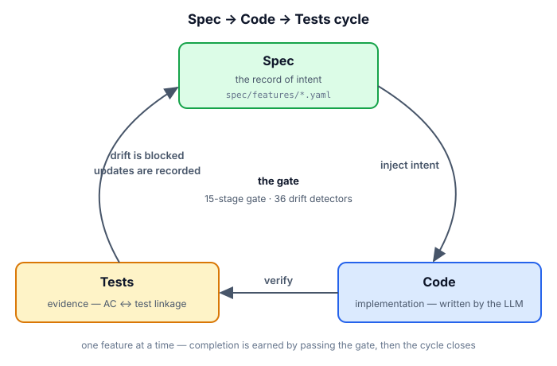
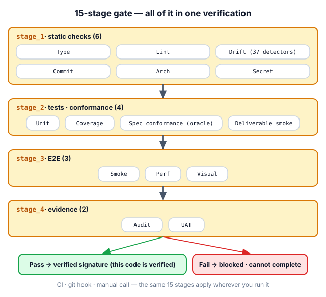

<p align="center">
  
</p>

<p align="center">
  <strong>English</strong> · <a href="README.ko.md">한국어</a>
</p>

<h1 align="center">cladding</h1>

<p align="center">
  <strong>The LLM writes the code — cladding owns what comes before and after.</strong><br/>
  True to the name (cladding = the protective shell), it's the verification layer wrapped around your host LLM.
</p>

<p align="center">
  <a href="https://github.com/qwerfunch/ironclad"></a>
  <a href="https://github.com/qwerfunch/ironclad"></a>
  
  
  <a href="LICENSE"></a>
</p>

<p align="center">
  The official reference implementation of the <a href="https://github.com/qwerfunch/ironclad">Ironclad</a> standard.<br/>
  Before your host LLM (Claude Code · Codex · Gemini · Cursor) <em>starts</em> work, cladding feeds it the project's intent;<br/>
  after it <em>finishes</em>, cladding verifies the result with 36 detectors and a 15-stage gate. A division of labor toward the same goal.
</p>

<!-- ─────────────── Host-LLM partnership loop ─────────────── -->
<div align="center">


</div>

<p align="center">
  <strong>This loop is after one thing —</strong><br/>
  turning the AI's <em>"it's done"</em> from a <strong>claim</strong> into a <strong>proof</strong>.
</p>

<p align="center">
  Intent is preserved as a record · drift is blocked automatically · completion is proven by a verification signature.<br/>
  So you can ship code an AI wrote with <strong>the same trust as code a human wrote</strong>.
</p>

<p align="center">
  For you, the developer, that means — less time spent reviewing AI code, the <em>why</em> of the code still there six months later,<br/>
  and no more judging "is this really done?" by gut feel before you ship.
</p>

<!-- ─────────────── How it partners with the host LLM ─────────────── -->
## How it works with your host LLM

cladding doesn't write code. Writing code is always the **host LLM's** job. What cladding takes on is the two things LLMs are bad at — *remembering the intent precisely when they start*, and *mechanically verifying the result when they finish*.

<table>
<tr>
<td width="33%" valign="top">

**Before — inject the intent**

*So the LLM starts with the right context.*

- **Project map injected** — every time a conversation starts, "how many features, what's in progress, the last verification result" is handed to the LLM automatically.
- **Only the intent that matters** — just the *why* of the feature at hand, its related features, and its acceptance criteria are pulled out (it does not dump the whole spec).
- **Project rules applied** — the forbidden and preferred patterns the team agreed on go in as standing instructions every time.

</td>
<td width="33%" valign="top">

**After — verify the result**

*If the LLM's output drifts from the spec, block it.*

- **15-stage verification gate** — type · lint · tests · coverage · architecture · secrets · E2E · evidence, all in one pass.
- **36 drift checks** — whether spec ↔ code ↔ test still agree, cross-checked automatically in every direction.
- **An implementation-blind grader** — a separate agent that *cannot read the code* grades it with tests written from the spec alone.
- **Run the deliverable for real** — the "tests pass but the program doesn't run" situation is blocked by actually running it.

</td>
<td width="33%" valign="top">

**Record — input for the next turn**

*Verification results flow back into the LLM's context.*

- **Verification signature** — the code state that cleared every check is saved to the repo as a signature: "this was verified at this point."
- **Audit ledger** — every verification run, completion attempt, and block is recorded with who · when · what result.
- **Repair card** — try to end a conversation leaving a deterministic check (drift · architecture · secret) failing and it blocks you once, then carries the failure summary forward into the next conversation's opening automatically.

</td>
</tr>
</table>

<p align="center">
While this loop runs, you just <strong>develop in natural language as usual</strong> — there are no commands to memorize.
</p>

<p align="center">
<sub>Real-time intervention (map injection · instant block · stop-block) all works on Claude Code. On Codex · Gemini · Cursor the same verification runs through in-conversation tool calls plus the git · CI gate.</sub>
</p>

<!-- ─────────────── done is earned ─────────────── -->
## "done" is earned, not declared

The chronic disease of AI coding is *"it's done"* declared with no verification behind it. In cladding, a feature's `status: done` is not a value you write — it's a value you **earn**.

<div align="center">



</div>

1. When the AI tries to **write the completion mark itself** → it's **blocked on the spot** ("earn completion by verifying it") — Claude Code real-time; on other hosts the gate · CI play the same role.
2. When the AI **requests** completion → all 9 deterministic stages (type · lint · drift · architecture · secret · tests · coverage · spec conformance · deliverable smoke) run, and it's recorded as done **only if every one passes**; one failure and it auto-reverts — the E2E · evidence stages are handled by CI's full 15.
3. The moment it passes, a **verification signature** is left behind — committable proof that "this code was verified at this point."
4. Try to end a conversation leaving a failure → it **blocks you once** (end again on the same failure and it records the fact rather than letting it through) and carries the repair card into the next conversation.

The limits are disclosed plainly too: bypass paths exist that the instant block can't see, and those are caught by after-the-fact verification (the gate · drift checks). The instant block is the first line of defense, after-the-fact verification the second — and neither is a standalone guarantee.

<!-- ─────────────── What changes ─────────────── -->
## What changes

How a *vanilla AI coding environment* and a cladding environment behave in the same situation.

| Situation | Vanilla AI coding | cladding |
|---|:---|:---|
| **Code drifts from the spec** | fixed *if* a reviewer notices | auto-detected right after the edit (alert) · "done" can't pass while it's drifting |
| **The AI says "it's done"** | you can only take its word | `done` earned only when the gate is GREEN |
| **Ending a session in a failing state** | exits as-is, forgotten next time | the exit is blocked once, the repair card handed off |
| **Two devs add a feature at the same time** | merge conflict | hash-8 IDs · separate files → 0 conflicts |
| **Who verifies the AI-written code?** | the AI that wrote it self-certifies (risky) | an implementation-blind grader + the mechanical gate |
| **Switching AI tools** | reconfigure per tool | one spec → 4 hosts wired automatically |

<!-- ─────────────── How it works ─────────────── -->
## How it works

**Spec → Code → Tests** runs as a single cycle — the spec records the *why*, the gate verifies, and the detectors block drift.

<div align="center">



</div>

### 1. Spec — the single source of intent (SSoT)

The spec records the *why* (what we're building and why). A 4-tier single source of truth — *intent on top, the implementation below*.

| Tier | Role | Who edits | Authority |
|---|---|---|---|
| **A — Spec** | intent (what to build) | humans define | sealed · LLMs cannot edit |
| **B — Design** | design (how to build it) | humans edit freely | checked against A |
| **C — Derived** | implementation (code · tests) + **attestation** (verification signature) | LLMs · humans | regenerated by reading the code |
| **D — Audit** | audit record (what actually happened) | append-only | immutable |

**A outranks every tier below it** — if spec (A) and code (C) disagree, the *code* is the one that's wrong. If the intent (A) wavers, everything wavers, so it's sealed against LLM edits.

**Sharded · multi-dev safe** — like `spec/features/<slug>-<hash>.yaml`, *each feature gets its own file* + an *8-char hash ID* (e.g. `F-d86375d8`). Two devs creating new features at the same time land in *different files with different IDs*, so zero merge conflicts. Details: [Hash-based feature IDs](docs/spec-ids-multi-dev.md).

<div align="center">



</div>

### 2. Gate — the 15-stage Iron Law

To be recognized as "done," a change must clear the strict gate (9 of the 15 stages are deterministic), and the full 15 stages — including E2E · evidence — are run by CI. The same check engine is applied in per-moment bundles: a fast 3 stages at commit time (when the git hook is installed), 9 stages at push · completion time, and all 15 in CI. Only the depth differs — the check logic is identical.

<div align="center">



</div>

| Stage | What it checks |
|---|---|
| **1.1 Type · 1.2 Lint** | type errors · code style |
| **1.3 Drift** | spec ↔ code mismatches across 36 detectors |
| **1.4 Commit · 1.5 Arch · 1.6 Secret** | clean working tree · architecture invariants · leaked API keys |
| **2.1 Unit · 2.2 Coverage** | unit tests pass · coverage drop blocked |
| **2.3 Spec conformance · 2.4 Deliverable smoke** | the implementation-blind grader's tests pass · the declared deliverable actually runs *(blocks the empty-green "tests pass but the deliverable doesn't run")* |
| **3.1 Smoke · 3.2 Perf · 3.3 Visual** | e2e critical paths · performance budgets · UI visual regression |
| **4.1 Audit · 4.2 UAT** | every AC (acceptance criterion) has at least one piece of evidence · every done feature has at least one piece of evidence |

### 3. Detector — 36 drift detectors

Drift in every direction across spec · code · test is detected automatically. Full catalog: [detector catalog](src/stages/detectors/README.md).

<table>
<thead>
<tr><th>Direction</th><th>What it catches</th><th align="center">Count</th><th>Representative detectors</th></tr>
</thead>
<tbody>
<tr><td>spec ↔ code</td><td>in the spec but missing from code, or code that strays from the spec</td><td align="center">10</td><td><code>MISSING_IMPLEMENTATION</code>, <code>AC_DRIFT</code>, <code>DELIVERABLE_INTEGRITY</code></td></tr>
<tr><td>code ↔ test</td><td>code present but no tests · coverage drop · secrets</td><td align="center">6</td><td><code>MISSING_TESTS</code>, <code>COVERAGE_DROP</code>, <code>HARDCODED_SECRET</code></td></tr>
<tr><td>spec ↔ test</td><td>an AC in the spec not verified by a test · false status</td><td align="center">5</td><td><code>UNTESTED_AC</code>, <code>STATUS_DRIFT</code>, <code>SPEC_CONFORMANCE</code></td></tr>
<tr><td>spec hygiene</td><td>the spec's own integrity (ID collisions · dependency cycles)</td><td align="center">8</td><td><code>ID_COLLISION</code>, <code>SLUG_CONFLICT</code>, <code>DEPENDENCY_CYCLE</code></td></tr>
<tr><td>environment integrity</td><td>build environment · meta files</td><td align="center">3</td><td><code>HARNESS_INTEGRITY</code>, <code>META_INTEGRITY</code></td></tr>
<tr><td>verification freshness</td><td>whether code changed since the verification signature</td><td align="center">1</td><td><code>STALE_ATTESTATION</code> <em>(new in 0.6.0)</em></td></tr>
<tr><td>governance · docs</td><td>policy violations · doc drift</td><td align="center">3</td><td><code>ABSENCE_OF_GOVERNANCE</code>, <code>PROJECT_CONTEXT_DRIFT</code></td></tr>
</tbody>
</table>

### 4. Cycle — one feature's lifecycle

Define → Sync → Implement → **Earn**. You earn "done" only by passing every check.

<div align="center">


</div>

<!-- ─────────────── Multi-Agent ─────────────── -->
## Multi-Agent — separating the builder from the verifier

The agents that **build** are kept separate from the agents that **verify**, so no agent can sign off on its own work. 0.6.0's **blind-author** goes one step further — the agent that writes the tests *has no tool to read the implementation at all* (no Read/Grep granted). "Wrote it without looking at the implementation" becomes a structural fact, not a promise. This separation maps directly onto regulatory · audit regimes (EU AI Act · SOX).

<div align="center">


</div>

<!-- ─────────────── Ecosystem ─────────────── -->
## Ecosystem

cladding sits at the junction of three existing categories.

<div align="center">



</div>

### How it differs from the neighbors

- **Spec Kit · OpenSpec · Tessl · Kiro** — tools that help you *write a good spec*. On top of that, cladding *keeps continuously cross-checking, inside the dev loop, that the spec and the actual code don't drift* — at completion time · commit · all the way through CI.
- **BMAD · ChatDev · Claude Code Agent Teams** — systems for *splitting roles across multiple AI agents*. cladding's agent division of labor runs with *spec · gate · audit record* combined on top.
- **tdd-guard** — a tool that *forces the AI to write tests first*. The Unit · Coverage · oracle stages among cladding's 15 do the same job, more structurally.
- **OpenHands · Cline · Aider · Goose** — *runners that make the AI write code*. cladding is the *upper layer that verifies and governs* the code those runners produce.

cladding's distinction is the *combination* — binding the core of the categories above into *one verification loop*.

<!-- ─────────────── Install ─────────────── -->
## Install

Two steps — install the infrastructure → create the project spec.

### Step 1 — Install the infrastructure (npm)

```bash
npm install -g cladding   # install the cladding CLI
cd <project>              # move into the project
clad setup                # auto-wire your AI tools (Claude / Codex / Gemini / Cursor)
```

A single `clad setup` auto-detects the AI tools you have installed and wires them all — no per-tool configuration needed.

<details>
<summary>Where <code>clad setup</code> connects (4 hosts · 5 wire points)</summary>

| Host (when detected) | Wired location | Auto-activation |
|---|---|---|
| Claude Code (`~/.claude/`) | `~/.claude/plugins/cladding` | `claude plugin marketplace add` + `install` |
| Codex CLI skills (`~/.agents/`) | `~/.agents/skills/cladding-*` | (auto on Codex restart) |
| Codex CLI MCP server (`~/.codex/`) | `[mcp_servers.cladding]` in `~/.codex/config.toml` | (TOML entry itself) |
| Gemini CLI (`~/.gemini/`) | `~/.gemini/extensions/cladding` | `gemini extensions link` |
| Cursor (`~/.cursor/`) | `mcpServers.cladding` in `~/.cursor/mcp.json` | (JSON entry itself) |

`clad setup` invokes each host's activation command automatically when the `claude` / `gemini` binaries are on PATH. Safe to re-run after an upgrade or after installing a new AI tool.

**Verification level (honesty note):** Claude Code is fully verified through real-usage campaigns (including real-time intervention). Codex · Gemini CLI have automated wiring + basic behavior confirmed. Cursor wires automatically, but real-usage verification is still pending — to be updated as it lands.

> **About the MCP server.** All 4 hosts wire cladding as an MCP server — only the wire *location* differs. MCP is not something you invoke directly — no `/mcp` slash, no manual connect step. The AI in each host calls cladding's tools on its own in response to *natural-language requests*; you only type `/cladding:init` once and chat normally.

</details>

### Step 2 — Init (create the project spec)

From the project directory, call it once inside your AI tool:

```
[inside your AI tool] /cladding:init "B2B payment SaaS"
```

The project's `spec.yaml` and supporting docs are created — once per project.

To raise enforcement: `clad init --with-hook` (install pre-commit + pre-push git hooks) · `clad init --with-ci` (scaffold the CI gate — true enforcement lives in CI).

### Three init scenarios

| Starting point | Command | What happens |
|---|---|---|
| **An idea, nothing else** | `/cladding:init "I'm going to build a B2B payment SaaS"` | LLM analyzes the domain → spec · docs · policies generated + 2–3 follow-up questions |
| **A planning doc** | `/cladding:init docs/plan.md` | recognizes the file path → loads the contents automatically and uses them as intent |
| **Adopting into an existing project** | `/cladding:init "apply cladding to this project"` | auto-scans the existing code → observed patterns merged with the intent |

### Init once, that's it

Init once and you're done — after that, just develop as usual. cladding runs the before/after loop in the background, so there are no commands to memorize.

### Upgrading

```
npm update -g cladding     # 1. install the new version
cd <your project>          # 2. once per project
clad update                # 3. bring it in line with the new version
```

Your code · `spec.yaml` · docs are left untouched, so it's safe — and if the newer version is stricter and has something to flag, it just **points it out** (it won't block or fix anything).

<!-- ─────────────── Status ─────────────── -->
## Status

<table align="center" border="0">
<tr>
<td align="center" width="140" style="background:#f8fafc;padding:18px 10px;border-radius:8px">
<div style="font-size:11px;color:#64748b;letter-spacing:1.5px;text-transform:uppercase;font-weight:600">version</div>
<div style="font-size:24px;font-weight:800;color:#0f172a;margin:8px 0;letter-spacing:-0.5px">v0.6.0</div>
<div style="font-size:11px;color:#64748b">2026-06</div>
</td>
<td align="center" width="140" style="background:#dcfce7;padding:18px 10px;border-radius:8px">
<div style="font-size:11px;color:#15803d;letter-spacing:1.5px;text-transform:uppercase;font-weight:600">conformance</div>
<div style="font-size:24px;font-weight:800;color:#16a34a;margin:8px 0;letter-spacing:-0.5px">L4</div>
<div style="font-size:11px;color:#15803d"><a href="https://github.com/qwerfunch/ironclad/blob/main/GOVERNANCE.md">top of L0–L4 · self-declared</a></div>
</td>
<td align="center" width="140" style="background:#f8fafc;padding:18px 10px;border-radius:8px">
<div style="font-size:11px;color:#64748b;letter-spacing:1.5px;text-transform:uppercase;font-weight:600">tests</div>
<div style="font-size:24px;font-weight:800;color:#0f172a;margin:8px 0;letter-spacing:-0.5px">1384<span style="font-size:16px;color:#94a3b8">/1384</span></div>
<div style="font-size:11px;color:#64748b">all pass</div>
</td>
<td align="center" width="140" style="background:#f8fafc;padding:18px 10px;border-radius:8px">
<div style="font-size:11px;color:#64748b;letter-spacing:1.5px;text-transform:uppercase;font-weight:600">gate</div>
<div style="font-size:24px;font-weight:800;color:#0f172a;margin:8px 0;letter-spacing:-0.5px">15<span style="font-size:16px;color:#94a3b8"> stages</span></div>
<div style="font-size:11px;color:#64748b">36 detectors</div>
</td>
<td align="center" width="140" style="background:#f8fafc;padding:18px 10px;border-radius:8px">
<div style="font-size:11px;color:#64748b;letter-spacing:1.5px;text-transform:uppercase;font-weight:600">features</div>
<div style="font-size:24px;font-weight:800;color:#0f172a;margin:8px 0;letter-spacing:-0.5px">171</div>
<div style="font-size:11px;color:#64748b">170 done · self-spec'd</div>
</td>
</tr>
</table>

<p align="center"><sub>134 test files · coverage drop blocked by the COVERAGE_DROP detector · single install path via npm (<code>npm install -g cladding</code>)</sub></p>

> **Road to Ironclad 1.0** — 1.0 locks only when *two independent implementations pass the L4 conformance fixtures* ([GOVERNANCE § 1](https://github.com/qwerfunch/ironclad/blob/main/GOVERNANCE.md)). cladding is the first.

## Docs

- [Why cladding (project context)](docs/project-context.md)
- [4-tier governance model](docs/ssot-model.md)
- [Hash-based feature IDs](docs/spec-ids-multi-dev.md)
- [36 detector catalog](src/stages/detectors/README.md)
- [Glossary (EN · KO)](docs/glossary.md)
- [Governance · roadmap to 1.0](GOVERNANCE.md)

## License

MIT. [LICENSE](LICENSE) · Related: [Ironclad](https://github.com/qwerfunch/ironclad) (the standard cladding implements) · [harness-boot](https://github.com/qwerfunch/harness-boot) (the seed).
